# Równoległy analizator logów systemowych

## Raport z projektu z przedmiotu Programowanie Równoległe i Rozproszone

**Temat**: Analiza logów systemowych (zliczanie i filtrowanie)

**Technologie**: OpenMP, MPI, CUDA

**Autorzy**: Kurc Jakub, Kusper Karol - DS2

**Data**: [08.12.2025]

---

## Spis treści

1. [Wstęp](#1-wstęp)
2. [Architektura i technologie](#2-architektura-i-technologie)
3. [Implementacja - analiza kodu](#3-implementacja---analiza-kodu)
4. [Instrukcja obsługi aplikacji](#4-instrukcja-obsługi-aplikacji)
5. [Testy i analiza wydajności](#5-testy-i-analiza-wydajności)
6. [Analiza wyników i wnioski](#6-analiza-wyników-i-wnioski)
7. [Podsumowanie](#7-podsumowanie)

---

# 1. WSTĘP

## 1.1. Cel projektu

Celem projektu jest opracowanie efektywnego narzędzia do równoległej analizy wielkich zbiorów danych tekstowych, w szczególności plików logów systemowych. Współczesne systemy informatyczne generują ogromne ilości danych diagnostycznych, których analiza w czasie rzeczywistym staje się kluczowym wyzwaniem dla administratorów systemów oraz zespołów monitorujących infrastrukturę IT.

Problem analizy logów dotyczy wielu dziedzin zastosowań. Serwery webowe generują setki gigabajtów zapisów każdego dnia, zawierających informacje o żądaniach HTTP, błędach aplikacji oraz próbach nieautoryzowanego dostępu. Systemy IoT (Internet of Things) produkują strumienie danych z czujników wymagających ciągłej analizy w celu wykrywania anomalii. Aplikacje rozproszone zapisują zdarzenia z wielu węzłów, które należy agregować i korelować w celu diagnostyki problemów wydajnościowych.

Projekt realizuje narzędzie umożliwiające zliczanie częstości występowania określonych słów lub fraz w plikach tekstowych, filtrowanie wierszy według zadanych kryteriów oraz tworzenie statystyk czasowych zdarzeń. Program analizuje pliki logów i pozwala na identyfikację wzorców, takich jak liczba błędów krytycznych w określonym przedziale czasowym, częstotliwość określonych zdarzeń na minutę lub godzinę, oraz wyodrębnianie linii spełniających złożone kryteria filtrowania.

Funkcjonalność programu obejmuje następujące możliwości: zliczanie wystąpień dowolnej liczby fraz jednocześnie, filtrowanie rekordów według poziomu logowania (ERROR, WARNING, INFO, DEBUG), ograniczanie analizy do określonego okna czasowego, generowanie statystyk czasowych z zadaną granularnością (minuty lub godziny), oraz opcjonalne wypisywanie dopasowanych linii na standardowe wyjście lub do pliku.

## 1.2. Założenia projektu

Głównym założeniem projektowym jest wykorzystanie trzech komplementarnych poziomów równoległości w celu maksymalizacji wydajności przetwarzania. Każda z zastosowanych technologii adresuje inny aspekt problemu wydajnościowego.

Technologia OpenMP (Open Multi-Processing) stanowi pierwszy poziom równoległości, realizowany na poziomie wątków procesora w pamięci współdzielonej. OpenMP umożliwia równoległą tokenizację tekstu oraz budowanie lokalnych słowników fraz przez poszczególne wątki, które następnie są scalane w fazie redukcji. Wykorzystanie dyrektyw kompilatora upraszcza implementację i pozwala na szybkie prototypowanie równoległych algorytmów bez konieczności ręcznego zarządzania wątkami.

Drugi poziom równoległości realizuje biblioteka MPI (Message Passing Interface), która pozwala na podział pracy między wiele procesów działających w rozproszonym środowisku. W kontekście analizy plików MPI umożliwia podział dużego pliku na fragmenty, które są przetwarzane niezależnie przez różne procesy. Każdy proces MPI może działać na osobnym rdzeniu procesora lub nawet na innym węźle obliczeniowym w klastrze, co pozwala na skalowanie do bardzo dużych zbiorów danych. Po zakończeniu obliczeń, proces główny (rank 0) zbiera i agreguje wyniki od pozostałych procesów.

Trzeci poziom równoległości stanowi przyspieszenie GPU przy użyciu technologii CUDA (Compute Unified Device Architecture). Karty graficzne oferują tysiące rdzeni obliczeniowych działających równolegle, co czyni je idealnymi do operacji agregacji danych. W projekcie CUDA wykorzystywana jest do budowania histogramów zliczających wystąpienia fraz. Kernel GPU przyjmuje listę indeksów znalezionych dopasowań i przy użyciu operacji atomowych inkrementuje liczniki w pamięci globalnej karty graficznej.

Cel wydajnościowy projektu zakłada osiągnięcie przepustowości przetwarzania rzędu gigabajtów na sekundę dla typowych plików logów. Architektura trójpoziomowa pozwala na adaptację do różnych środowisk obliczeniowych: od laptopa z wielordzeniowym procesorem, przez stację roboczą z kartą graficzną NVIDIA, po klaster obliczeniowy z dziesiątkami węzłów. Modularność rozwiązania umożliwia selektywne wyłączanie poszczególnych poziomów równoległości w zależności od dostępnych zasobów sprzętowych.


## 1.4. Opis danych testowych


Plik `access.log` ma rozmiar ~10 GB i zawiera zapisy aktywności serwera webowego w standardowym formacie logów Apache/Nginx. Każda linia reprezentuje pojedyncze żądanie HTTP i zawiera następujące informacje: adres IP klienta, znacznik czasowy, metodę HTTP (GET, POST, PUT, DELETE), żądany zasób (URL), kod odpowiedzi HTTP (200, 404, 500 itd.) oraz rozmiar odpowiedzi w bajtach. Format czasowy jest zgodny ze specyfikacją Common Log Format (CLF), co ułatwia parsowanie i ekstrakcję informacji temporalnych.

Struktura pojedynczego rekordu wygląda następująco:
```
192.168.1.100 - - [01/Jan/2019:12:34:56 +0000] "GET /api/products HTTP/1.1" 200 1234
```

Analiza tego zbioru danych pozwala na realizację typowych przypadków użycia, takich jak: zliczanie żądań według metody HTTP (GET vs POST), identyfikacja najpopularniejszych endpointów API, analiza rozkładu kodów błędów (4xx, 5xx), wykrywanie anomalii w ruchu sieciowym, oraz tworzenie profili aktywności użytkowników w czasie.

---

# 2. ARCHITEKTURA I TECHNOLOGIE

## 2.1. Architektura ogólna systemu

System składa się z trzech głównych komponentów tworzących pełne środowisko do analizy logów oraz wizualizacji wyników. Architektura została zaprojektowana w sposób modularny, umożliwiający niezależne działanie poszczególnych elementów.

Centralnym komponentem jest program analityczny napisany w C++, który implementuje algorytmy przetwarzania równoległego z wykorzystaniem OpenMP, MPI oraz CUDA. Program operuje w trybie wsadowym, przyjmując na wejściu ścieżkę do pliku logów oraz parametry określające sposób analizy. Komunikacja odbywa się poprzez standardowe wejście i wyjście systemu operacyjnego, co pozwala na łatwą integrację z innymi narzędziami Unix-owymi poprzez potoki i przekierowania.

Backend aplikacji webowej zaimplementowano przy użyciu frameworka FastAPI w języku Python. Serwer udostępnia interfejs RESTful API umożliwiający zdalne wykonywanie testów wydajnościowych oraz pobieranie wyników. Backend pełni rolę adaptera między interfejsem webowym a programem C++, uruchamiając go jako podproces systemowy i przechwytując jego wyjście. Serwer działa domyślnie na porcie 8000 i obsługuje żądania HTTP z Cross-Origin Resource Sharing (CORS), co pozwala na komunikację z frontendem działającym w oddzielnej domenie.

Frontend stanowi aplikacja jednostronicowa (SPA) zbudowana w React z TypeScript i Vite jako narzędziem budowania. Interfejs użytkownika prezentuje listę predefiniowanych scenariuszy testowych, umożliwia modyfikację parametrów uruchomienia (liczba wątków, włączenie CUDA, dodatkowe argumenty CLI), oraz wyświetla wyniki w formie tabel i wykresów. Aplikacja komunikuje się z backendem poprzez asynchroniczne żądania HTTP wykorzystując Fetch API przeglądarki.

```
┌─────────────────────────────────────────┐
│         Frontend (React)                │
│      http://localhost:5173              │
│                                         │
│  - Lista testów                        │
│  - Konfiguracja parametrów             │
│  - Wizualizacja wyników                │
└────────────┬────────────────────────────┘
             │
             │ HTTP POST/GET
             │ (JSON)
             ▼
┌─────────────────────────────────────────┐
│         Backend (FastAPI)               │
│      http://localhost:8000              │
│                                         │
│  - RESTful API endpoints               │
│  - Uruchamianie testów                 │
│  - Parsowanie wyników                  │
└────────────┬────────────────────────────┘
             │
             │ subprocess.run()
             │ (stdin/stdout)
             ▼
┌─────────────────────────────────────────┐
│      Program C++ (prir)                 │
│      ./build/bin/prir                   │
│                                         │
│  - OpenMP (wątki CPU)                  │
│  - MPI (procesy rozproszone)           │
│  - CUDA (kernel GPU)                   │
│  - Analiza pliku access.log            │
└─────────────────────────────────────────┘
```


## 2.2. Wybór technologii równoległości

### 2.2.1. OpenMP

OpenMP (Open Multi-Processing) jest standardem definiującym zestaw dyrektyw kompilatora, funkcji bibliotecznych oraz zmiennych środowiskowych przeznaczonych do programowania równoległego w architekturach pamięci współdzielonej (shared memory). Główną zaletą OpenMP jest prostota implementacji równoległości poprzez adnotacje do istniejącego kodu sekwencyjnego, co znacząco obniża próg wejścia w porównaniu z niskopoziomowym programowaniem wątkowym.

W kontekście projektu OpenMP wykorzystywany jest do równoległego przetwarzania wierszy pliku logów. Dyrektywa `#pragma omp parallel` tworzy zespół wątków, które wykonują kod znajdujący się w następującym bloku. Dyrektywa `#pragma omp for` dzieli iteracje pętli między dostępne wątki, realizując dekompozycję danych (data parallelism). Model fork-join zapewnia, że wszystkie wątki synchronizują się na końcu regionu równoległego przed kontynuacją wykonania sekwencyjnego.

Kluczową funkcjonalnością OpenMP w projekcie jest dynamiczny load balancing realizowany przez klauzulę `schedule(dynamic, chunk_size)`. W przeciwieństwie do statycznego podziału, gdzie każdy wątek otrzymuje z góry określony zakres iteracji, podział dynamiczny pozwala wątkom pobierać kolejne porcje pracy w trakcie wykonania. Jest to istotne, ponieważ linie w pliku logów mają różną długość i wymagają różnego nakładu obliczeniowego (parsowanie daty, dopasowywanie wyrażeń, zliczanie wystąpień). Wątki, które szybciej kończą swoją porcję pracy, mogą natychmiast pobrać kolejną, co minimalizuje czas bezczynności.

Projekt wykorzystuje także sekcje krytyczne (`#pragma omp critical`) do synchronizacji dostępu do współdzielonych struktur danych podczas scalania lokalnych wyników wątków. Sekcja krytyczna gwarantuje, że tylko jeden wątek na raz może wykonywać zawarty w niej kod, co jest niezbędne do zachowania spójności danych przy aktualizacji globalnych liczników oraz map.

Zastosowanie OpenMP w projekcie realizuje pierwszy poziom równoległości, efektywnie wykorzystując wiele rdzeni współczesnych procesorów bez konieczności jawnego zarządzania wątkami czy muteksami. Overhead związany z tworzeniem wątków i synchronizacją jest minimalny w porównaniu z korzyściami płynącymi z równoległego przetwarzania danych.

### 2.2.2. MPI

Message Passing Interface (MPI) jest standardem biblioteki do programowania systemów równoległych i rozproszonych, bazującym na paradygmacie przekazywania komunikatów (message passing). W przeciwieństwie do OpenMP, gdzie wątki współdzielą przestrzeń adresową, procesy MPI posiadają oddzielną pamięć i komunikują się poprzez jawne wysyłanie i odbieranie wiadomości.

W projekcie MPI służy do realizacji równoległości na poziomie procesów, gdzie każdy proces przetwarza niezależny fragment pliku logów. Kluczową funkcjonalnością jest podział pliku między procesy na podstawie offsetów bajtowych. Funkcje `MPI_Comm_size()` i `MPI_Comm_rank()` pozwalają każdemu procesowi ustalić swoją pozycję w grupie oraz liczbę procesów, na podstawie czego obliczany jest zakres bajtów do przetworzenia.

Implementacja podziału opiera się na równomiernej dekompozycji przestrzeni bajtowej pliku. Dla pliku o rozmiarze F bajtów i N procesów, proces o randze r przetwarza fragment od bajtu (F × r) / N do bajtu (F × (r+1)) / N. Taki podział może prowadzić do przecięcia linii w środku, dlatego procesy o randze większej od zera pomijają pierwszą niepełną linię, a proces o randze zero czyta ją w całości. Mechanizm ten zapewnia, że każda linia jest przetwarzana dokładnie raz.

Po zakończeniu lokalnego przetwarzania, każdy proces robotniczy (rank > 0) serializuje swoje wyniki do bufora binarnego i wysyła je do procesu głównego (rank 0) przy użyciu funkcji `MPI_Send()`. Proces główny odbiera wiadomości poprzez `MPI_Recv()` w pętli, scalając przychodzące wyniki poprzez sumowanie liczników oraz agregację statystyk czasowych. Ten wzorzec komunikacji nazywany jest redukcją master-worker.

Wykorzystanie MPI pozwala na skalowanie wydajności proporcjonalne do liczby procesów, przy założeniu wystarczającej granularności problemu. Ponieważ plik jest dużych rozmiarów (gigabajty), a komunikacja ogranicza się do przesłania końcowych wyników (zazwyczaj kilkadziesiąt kilobajtów), overhead komunikacyjny stanowi znikomy ułamek czasu obliczeń. MPI umożliwia także łatwe rozszerzenie rozwiązania na klaster obliczeniowy, gdzie procesy mogą działać na fizycznie rozdzielonych maszynach połączonych siecią.

### 2.2.3. CUDA

CUDA (Compute Unified Device Architecture) jest równoległą platformą obliczeniową oraz modelem programowania opracowanym przez firmę NVIDIA dla kart graficznych. GPU (Graphics Processing Unit) zawiera tysiące prostych rdzeni obliczeniowych zorganizowanych w Streaming Multiprocessors (SM), co czyni je idealnymi do obliczeń typu SIMD (Single Instruction Multiple Data) oraz operacji agregacyjnych.

W projekcie CUDA wykorzystywana jest do akceleracji budowania histogramów zliczających wystąpienia fraz. Po zakończeniu fazy przetwarzania tekstu przez wątki OpenMP, program posiada wektor indeksów reprezentujących dopasowane frazy. Wektor ten jest transferowany do pamięci globalnej GPU, gdzie kernel obliczeniowy inkrementuje odpowiednie liczniki w tablicy wyjściowej.

Kernel CUDA definiowany jest poprzez kwalifikator `__global__`, który oznacza funkcję wykonywaną na GPU i wywoływaną z CPU. Każdy wątek GPU (CUDA thread) identyfikowany jest poprzez unikalne indeksy: `blockIdx.x` (indeks bloku) oraz `threadIdx.x` (indeks wątku w bloku). Globalne ID wątku obliczane jest jako `blockIdx.x * blockDim.x + threadIdx.x`, gdzie `blockDim.x` to liczba wątków w bloku (zazwyczaj 256 lub 512).

Kluczowym elementem implementacji jest użycie operacji atomowych, konkretnie `atomicAdd()`, która gwarantuje poprawną aktualizację współdzielonego licznika w sytuacji, gdy wiele wątków GPU próbuje jednocześnie inkrementować tę samą wartość. Operacja atomowa zapewnia, że odczyt-modyfikacja-zapis odbywa się jako niepodzielna transakcja, eliminując race conditions.

Wykorzystanie GPU wiąże się z nakładem związanym z transferem danych między pamięcią systemową (host) a pamięcią GPU (device). Funkcja `cudaMemcpy()` realizuje kopiowanie danych z flagami określającymi kierunek transferu: `cudaMemcpyHostToDevice` oraz `cudaMemcpyDeviceToHost`. Dla małych zbiorów danych overhead transferu może przewyższać korzyści z równoległego przetwarzania, dlatego CUDA jest opcjonalna i włączana poprzez parametr `--use-cuda`.

W przypadku braku karty NVIDIA lub wystąpienia błędu podczas inicjalizacji CUDA, program automatycznie przełącza się na obliczenia CPU bez przerywania działania. Ten mechanizm fallback zapewnia przenośność aplikacji na różne konfiguracje sprzętowe.

### 2.2.4. FastAPI i React

Backend aplikacji webowej zaimplementowano przy użyciu FastAPI, nowoczesnego frameworka webowego dla języka Python charakteryzującego się wysoką wydajnością oraz automatyczną generacją dokumentacji API. FastAPI bazuje na standardach OpenAPI i JSON Schema, co pozwala na automatyczne tworzenie interaktywnej dokumentacji dostępnej pod adresem `/docs`. Framework wykorzystuje anotacje typów Pythona (type hints) do walidacji danych wejściowych oraz serializacji odpowiedzi, co redukuje liczbę błędów runtime.

Głównym zastosowaniem backendu jest orkiestracja testów wydajnościowych. Endpoint `POST /api/tests/{test_id}/scenarios/{scenario_id}/run` przyjmuje identyfikatory testu i scenariusza oraz opcjonalne nadpisania parametrów (liczba wątków, włączenie CUDA, dodatkowe argumenty CLI). Backend konstruuje komendę systemową, uruchamia program C++ przy użyciu modułu `subprocess`, mierzy czas wykonania oraz parsuje wyjście programu. Dla testów typu perf-test backend wyciąga szczegółowe informacje o czasach CPU i CUDA przy użyciu wyrażeń regularnych.

Frontend aplikacji zbudowano jako Single Page Application (SPA) w bibliotece React z TypeScript jako językiem programowania. React umożliwia tworzenie komponentów UI o określonym stanie (state) oraz reaktywne odświeżanie widoku w odpowiedzi na zmiany danych. TypeScript dodaje statyczne typowanie do JavaScript, co pozwala na wczesne wykrywanie błędów podczas kompilacji oraz lepsze wsparcie IDE poprzez autouzupełnianie i refaktoryzację.

Aplikacja prezentuje listę testów zdefiniowanych w pliku `test_cases.json`, umożliwia wybór scenariusza testowego, modyfikację parametrów poprzez formularz, oraz uruchomienie testu przyciskiem. Po zakończeniu testu wyniki wyświetlane są w czytelnej formie: kod wyjścia, czas wykonania, standardowe wyjście oraz błędy. Dla testów perf-test frontend generuje porównawczą tabelę czasów CPU vs CUDA.

Wybór architektury klient-serwer z RESTful API pozwala na rozdzielenie warstwy prezentacji od logiki biznesowej. Frontend może być hostowany na osobnym serwerze lub udostępniany jako pliki statyczne, podczas gdy backend może działać na maszynie obliczeniowej posiadającej zasoby wymagane do uruchomienia testów (wiele rdzeni CPU, karta GPU). Komunikacja poprzez HTTP/JSON jest standardem przemysłowym, co ułatwia integrację z innymi systemami oraz rozbudowę o dodatkowe funkcjonalności.

## 2.3. Struktura projektu

Organizacja kodu źródłowego projektu jest hierarchiczna i zgodna z najlepszymi praktykami projektów C++ oraz aplikacji webowych. Katalog główny zawiera główne pliki konfiguracyjne oraz podkatalogi z kodem poszczególnych komponentów.

```
PRIR_Projekt/
├── src/
│   ├── main.cpp              # Główna logika programu (OpenMP + MPI)
│   ├── gpu_histogram.cu      # Kernel CUDA dla histogramu GPU
│   └── gpu_interface.hpp     # Interfejs C++ do funkcji CUDA
├── backend/
│   ├── main.py               # Serwer FastAPI
│   ├── requirements.txt      # Zależności Python
│   └── test_data/
│       └── test_cases.json   # Definicje scenariuszy testowych
├── frontend/
│   ├── src/
│   │   ├── App.tsx           # Główny komponent React
│   │   ├── types.ts          # Definicje typów TypeScript
│   │   └── main.tsx          # Punkt wejścia aplikacji
│   ├── package.json          # Zależności npm
│   └── vite.config.ts        # Konfiguracja narzędzia budowania
├── build/
│   └── bin/
│       └── prir              # Skompilowany program (po make)
├── plots/                    # Wygenerowane wykresy (po testach)
├── Makefile                  # System budowania
├── run_benchmarks.sh (3 skrypty opisane później)         # Skrypt automatyzacji testów
├── generate_plots.py         # Skrypt generowania wykresów
├── benchmark_results.csv     # Wyniki testów (po uruchomieniu)
├── access.log                # Plik danych testowych (3.3 GB)
├── README.md                 # Dokumentacja użytkownika

```

Katalog `src/` zawiera kod źródłowy programu analitycznego w C++. Plik `main.cpp` implementuje całą logikę aplikacji, łącznie z parsowaniem argumentów CLI, inicjalizacją MPI, czytaniem pliku, równoległym przetwarzaniem oraz agregacją wyników. Plik `gpu_histogram.cu` zawiera implementację kernela CUDA oraz funkcję hosta uruchamiającą obliczenia na GPU. Plik nagłówkowy `gpu_interface.hpp` definiuje interfejs między kodem C++ a CUDA, eksportując funkcję `gpu::histogram()`, która jest dostępna zarówno w trybie z CUDA jak i bez.

Katalog `backend/` zawiera serwer FastAPI wraz z plikiem `requirements.txt` listującym zależności Python. Podkatalog `test_data/` zawiera plik JSON definiujący testy, ich scenariusze, oczekiwane wyniki oraz dane referencyjne wydajności.

Katalog `frontend/` zawiera kod aplikacji React. Podkatalog `src/` zawiera pliki TypeScript definiujące komponenty UI, typy danych oraz logikę stanu aplikacji. Pliki `package.json` oraz `vite.config.ts` konfigurują środowisko budowania i zależności JavaScript.

Katalog `build/` jest tworzony automatycznie podczas kompilacji i zawiera pliki obiektowe oraz finalny plik wykonywalny `build/bin/prir`. Katalog ten jest ignorowany przez system kontroli wersji.

Makefile w katalogu głównym definiuje targets do kompilacji projektu: `make` (release build z optymalizacjami), `make debug` (build debugowy z symbolami), `make clean` (usunięcie plików obiektowych), oraz `make info` (wyświetlenie konfiguracji kompilacji). Makefile obsługuje zmienne sterujące: `USE_MPI`, `USE_OPENMP`, `USE_CUDA`, które pozwalają na selektywne włączanie poszczególnych technologii.

Pliki `run_benchmarks.sh` oraz `generate_plots.py` są skryptami automatyzującymi proces testowania wydajnościowego oraz wizualizacji wyników. Pierwsze uruchamia serię testów dla różnych konfiguracji i zapisuje wyniki do CSV. Drugi generuje wykresy porównawcze oraz plik tekstowy z podsumowaniem statystyk.

---

# 3. IMPLEMENTACJA - ANALIZA KODU

## 3.1. Główny plik: src/main.cpp

Plik `main.cpp` stanowi rdzeń programu i zawiera implementację wszystkich kluczowych algorytmów przetwarzania równoległego. Kod jest podzielony na funkcje realizujące poszczególne etapy przetwarzania: parsowanie argumentów, czytanie pliku, analizę danych, agregację wyników oraz wypisywanie statystyk.

### 3.1.1. Parsowanie argumentów CLI

Funkcja `parse_cli()` (linie 282-372) odpowiada za interpretację argumentów wiersza poleceń oraz walidację poprawności konfiguracji. Wykorzystuje strukturę `ProgramConfig` do przechowywania wszystkich opcji:

```cpp
struct ProgramConfig {
  std::string filePath;              // --file
  std::vector<std::string> phrases;  // --phrase (może być wiele)
  bool caseSensitive = false;        // --case-sensitive
  bool useCuda = false;              // --use-cuda
  bool cpuOnly = false;              // --cpu-only
  int threads = 0;                   // --threads (0 = auto)
  std::vector<std::string> severityFilters; // --level
  std::string fromTime;              // --from
  std::string toTime;                // --to
  bool statsEnabled = true;          // --stats / --no-stats
  std::string statsInterval = "hour"; // hour|minute
  bool emitMatches = false;          // --emit
  std::string emitFile;              // --emit-file
  bool countOnlyFiltered = false;    // --count-filtered
  bool perfTest = false;             // --perf-test
};
```

Parser iteruje przez tablicę `argv` i rozpoznaje flagi poprzez porównanie stringów. Dla opcji powtarzalnych (np. `--phrase`, `--level`) wartości są dodawane do wektorów. Parser wykonuje także walidację:

- Sprawdza obecność wymaganych parametrów (`--file`, przynajmniej jedna `--phrase`)
- Waliduje wzajemne wykluczanie się opcji (`--use-cuda` i `--cpu-only` nie mogą wystąpić jednocześnie)
- Weryfikuje dostępność CUDA w przypadku `--use-cuda` poprzez wywołanie `gpu::is_available()`
- Normalizuje frazy do małych liter, jeśli nie ustawiono `--case-sensitive`

Funkcja zwraca strukturę `ProgramConfig` lub kończy program z komunikatem błędu w przypadku niepoprawnych argumentów. Użycie struktury zamiast globalnych zmiennych poprawia testowalność i czytelność kodu.

### 3.1.2. Podział pliku między procesy MPI

Funkcja `read_chunk()` (linie 374-400) realizuje podział dużego pliku między procesy MPI poprzez obliczenie offsetów bajtowych i czytanie przydzielonego fragmentu. Implementacja rozpoczyna się od uzyskania informacji o środowisku MPI:

```cpp
int world = 1, rank = 0;
#ifdef USE_MPI
MPI_Comm_size(MPI_COMM_WORLD, &world);
MPI_Comm_rank(MPI_COMM_WORLD, &rank);
#endif
```

Dyrektywy preprocesora `#ifdef USE_MPI` pozwalają na kompilację warunkową, umożliwiając budowanie projektu bez MPI. W takim przypadku zmienne `world` i `rank` pozostają z wartościami domyślnymi (1 i 0), co odpowiada wykonaniu sekwencyjnemu.

Następnie program otwiera plik i oblicza jego rozmiar:

```cpp
std::ifstream in(cfg.filePath, std::ios::binary);
in.seekg(0, std::ios::end);
uint64_t fileSize = in.tellg();
```

Wykorzystanie trybu binarnego (`std::ios::binary`) zapewnia, że pozycje w pliku odpowiadają faktycznym offsetom bajtowym, niezależnie od systemu operacyjnego (Windows vs Unix line endings).

Obliczenie zakresu dla danego procesu odbywa się poprzez równomierne podzielenie przestrzeni bajtowej:

```cpp
uint64_t chunkStart = (fileSize * rank) / world;
uint64_t chunkEnd = (fileSize * (rank + 1)) / world;
in.seekg(chunkStart);
```

### 3.1.3. Równoległa analiza linii - OpenMP

Funkcja `analyze_chunk()` (linie 414-537) stanowi serce algorytmu przetwarzania i demonstruje zaawansowane użycie OpenMP. Funkcja przyjmuje wektor linii oraz konfigurację, i zwraca strukturę `LocalResults` zawierającą zliczone frazy, statystyki czasowe oraz dopasowane linie.

Przed rozpoczęciem regionu równoległego funkcja wykonuje przygotowania:

```cpp
LocalResults res;
res.phraseCounts.assign(cfg.phrases.size(), 0);

bool needTime = cfg.statsEnabled || !cfg.fromTime.empty() || !cfg.toTime.empty();
bool needSeverity = !cfg.severityFilters.empty();
```

Inicjalizacja wektora liczników zerami oraz ustalenie, które informacje należy ekstrahować z linii (timestamp, poziom logowania) pozwala uniknąć niepotrzebnych operacji parsowania.

Region równoległy definiowany jest następująco:

```cpp
#pragma omp parallel if (enableParallel)
{
  // Lokalne zmienne wątków
  std::vector<uint64_t> threadCounts(cfg.phrases.size(), 0);
  std::unordered_map<std::string, uint64_t> localBuckets;
  std::vector<std::string> localMatches;
  std::vector<uint32_t> localHits;  // Dla GPU

  #pragma omp for schedule(dynamic, 256) nowait
  for (long long idx = 0; idx < total; ++idx) {
    const std::string &line = chunk.lines[idx];

    // Przetwarzanie linii...
  }

  // Scalanie wyników
  #pragma omp critical
  {
    for (size_t i = 0; i < threadCounts.size(); ++i)
      res.phraseCounts[i] += threadCounts[i];

    for (auto &kv : localBuckets)
      res.timeBuckets[kv.first] += kv.second;

    res.matchingLines.insert(res.matchingLines.end(),
                             localMatches.begin(),
                             localMatches.end());
  }
}
```

Klauzula `if (enableParallel)` pozwala na selektywne wyłączenie równoległości dla małych plików, gdzie overhead tworzenia wątków nie jest uzasadniony. Zmienna `enableParallel` jest ustawiana na `true` dla plików większych niż 1000 linii.

Każdy wątek posiada prywatne kopie struktur danych (`threadCounts`, `localBuckets`, `localMatches`, `localHits`), co eliminuje potrzebę synchronizacji podczas przetwarzania linii. Jest to kluczowe dla wydajności, ponieważ dostęp do współdzielonych danych wymagałby użycia muteksów, drastycznie spowalniając wykonanie.

Dyrektywa `schedule(dynamic, 256)` realizuje dynamiczny load balancing. Pętla for jest dzielona na chunki po 256 iteracji, które są przydzielane wątkom na żądanie. Gdy wątek kończy przetwarzanie swojego chunka, otrzymuje kolejny z puli. Rozmiar chunka (256) jest kompromisem między overhead przydzielania a granularnością balansu obciążenia.

Klauzula `nowait` informuje kompilator, że nie jest wymagana bariera synchronizacyjna na końcu pętli for. Wątki mogą natychmiast przejść do kolejnych instrukcji (w tym przypadku do sekcji critical), co redukuje czas oczekiwania.

Wewnątrz pętli każda linia jest przetwarzana w kilku etapach:

1. **Ekstrakcja timestampu** (jeśli potrzebny):
```cpp
std::time_t ts = 0;
if (needTime) {
  ts = extract_timestamp(line);
}
```

Funkcja `extract_timestamp()` używa wyrażenia regularnego do znalezienia wzorca `YYYY-MM-DD HH:MM:SS` w linii i konwertuje go na `std::time_t`.

2. **Detekcja poziomu logowania** (jeśli potrzebna):
```cpp
std::string severity;
bool severityOk = true;
if (needSeverity) {
  std::string upper = to_upper(line);
  severity = detect_severity(upper, cfg.severityUniverse);
  severityOk = cfg.severityFilters.count(severity) > 0;
}
```

Funkcja `detect_severity()` szuka słów kluczowych (ERROR, WARNING, INFO, DEBUG, CRITICAL) w linii i zwraca pierwszy znaleziony poziom.

3. **Weryfikacja filtrów**:
```cpp
bool windowOk = time_in_window(cfg, ts);
bool selected = severityOk && windowOk;
```

Linia jest uznawana za dopasowaną, jeśli spełnia wszystkie kryteria filtrowania.

4. **Aktualizacja statystyk** (dla dopasowanych linii):
```cpp
if (selected) {
  ++localMatched;

  if (cfg.statsEnabled) {
    std::string bucketKey = make_bucket(ts, cfg.statsInterval);
    ++localBuckets[bucketKey];
  }

  if (cfg.emitMatches) {
    localMatches.push_back(line);
  }
}
```

Funkcja `make_bucket()` zaokrągla timestamp do początku godziny lub minuty, tworząc klucz typu `"2019-01-15 14:00"`.

5. **Zliczanie fraz**:
```cpp
bool allowCounts = !cfg.countOnlyFiltered || selected;
if (allowCounts) {
  std::string lowered = cfg.caseSensitive ? line : to_lower(line);

  for (size_t p = 0; p < cfg.phrasesNormalized.size(); ++p) {
    size_t matches = count_occurrences(lowered, cfg.phrasesNormalized[p]);

    if (cfg.useCuda) {
      for (size_t k = 0; k < matches; ++k) {
        localHits.push_back(p);  // Zapisz indeks frazy dla GPU
      }
    } else {
      threadCounts[p] += matches;  // Zlicz od razu na CPU
    }
  }
}
```

Funkcja `count_occurrences()` używa metody `std::string_view::find()` w pętli do zliczania wszystkich wystąpień podciągu w tekście. W trybie GPU wystąpienia są zapisywane jako indeksy do późniejszego przetworzenia przez kernel, w trybie CPU są natychmiast dodawane do liczników.

Po zakończeniu pętli każdy wątek ma swoje lokalne wyniki, które należy scalić. Sekcja krytyczna zapewnia wzajemne wykluczanie:

```cpp
#pragma omp critical
{
  for (size_t i = 0; i < threadCounts.size(); ++i)
    res.phraseCounts[i] += threadCounts[i];

  for (auto &kv : localBuckets)
    res.timeBuckets[kv.first] += kv.second;

  res.matchingLines.insert(res.matchingLines.end(),
                           localMatches.begin(),
                           localMatches.end());

  if (cfg.useCuda) {
    res.gpuHits.insert(res.gpuHits.end(),
                      localHits.begin(),
                      localHits.end());
  }
}
```

Sekcja krytyczna jest potencjalnym wąskim gardłem, ponieważ tylko jeden wątek może wykonywać ten kod w danym momencie. Jednak dzięki temu, że każdy wątek wykonuje tę sekcję tylko raz (na końcu przetwarzania), overhead synchronizacji jest minimalny w porównaniu do całkowitego czasu obliczeń.

### 3.1.4. Histogram na GPU - CUDA

Interfejs między C++ a CUDA definiowany jest w pliku `gpu_interface.hpp`, który eksportuje namespace `gpu` z dwiema funkcjami:

```cpp
namespace gpu {

bool is_available() {
  // Sprawdza dostępność CUDA
#ifdef USE_CUDA
  return check_cuda_device();
#else
  return false;
#endif
}

bool histogram(const std::vector<uint32_t> &values,
               size_t bucketCount,
               std::vector<uint64_t> &out) {
  // Wywołuje kernel CUDA lub fallback do CPU
#ifdef USE_CUDA
  return gpu_histogram_count(values.data(), values.size(),
                             bucketCount, out.data());
#else
  return false;  // Fallback w main.cpp
#endif
}

}
```

Implementacja kernela znajduje się w pliku `gpu_histogram.cu`:

```cpp
__global__ void histogram_kernel(const uint32_t *values,
                                 size_t count,
                                 unsigned long long *out)
{
  size_t stride = blockDim.x * gridDim.x;
  size_t gid = blockIdx.x * blockDim.x + threadIdx.x;

  for (size_t i = gid; i < count; i += stride) {
    uint32_t bucket = values[i];
    atomicAdd(&out[bucket], 1ULL);
  }
}
```

Kernel wykorzystuje grid-stride loop pattern, gdzie każdy wątek przetwarza wiele elementów tablicy wejściowej. Zmienna `stride` reprezentuje całkowitą liczbę wątków w gridzie (liczba bloków × liczba wątków na blok), a `gid` to globalny identyfikator wątku.

W pętli for każdy wątek zaczyna od swojego indeksu `gid` i przeskakuje o `stride` elementów w każdej iteracji. Taki wzorzec zapewnia dobrą koalescencję dostępu do pamięci oraz umożliwia przetwarzanie dowolnej liczby elementów niezależnie od liczby wątków.

Operacja `atomicAdd()` jest kluczowa dla poprawności algorytmu. Funkcja ta gwarantuje, że operacja odczyt-inkrementacja-zapis jest wykonywana atomowo, co oznacza, że w sytuacji, gdy wiele wątków jednocześnie próbuje zinkrementować ten sam licznik, wszystkie operacje są wykonywane sekwencyjnie i żadna aktualizacja nie jest tracona.

Funkcja hosta `gpu_histogram_count()` zarządza cyklem życia pamięci GPU:

```cpp
extern "C" bool gpu_histogram_count(const uint32_t *values,
                                    size_t count,
                                    size_t bucketCount,
                                    uint64_t *out)
{
  // 1. Alokacja pamięci GPU
  uint32_t *d_values = nullptr;
  unsigned long long *d_out = nullptr;

  cudaMalloc(&d_values, count * sizeof(uint32_t));
  cudaMalloc(&d_out, bucketCount * sizeof(unsigned long long));

  // 2. Inicjalizacja liczników zerami
  cudaMemset(d_out, 0, bucketCount * sizeof(unsigned long long));

  // 3. Transfer CPU -> GPU
  cudaMemcpy(d_values, values, count * sizeof(uint32_t),
             cudaMemcpyHostToDevice);

  // 4. Uruchomienie kernela
  int blockSize = 256;
  int numBlocks = (count + blockSize - 1) / blockSize;
  histogram_kernel<<<numBlocks, blockSize>>>(d_values, count, d_out);

  // 5. Synchronizacja
  cudaDeviceSynchronize();

  // 6. Transfer GPU -> CPU
  cudaMemcpy(out, d_out, bucketCount * sizeof(unsigned long long),
             cudaMemcpyDeviceToHost);

  // 7. Zwolnienie pamięci
  cudaFree(d_values);
  cudaFree(d_out);

  return true;
}
```

Sekwencja operacji jest typowa dla aplikacji CUDA. Pamięć jest alokowana osobno na hoście i device, dane są kopiowane do GPU, kernel jest uruchamiany asynchronicznie, program czeka na zakończenie obliczeń, wyniki są kopiowane z powrotem do pamięci systemowej, a na końcu pamięć GPU jest zwalniana.

Dobór parametrów uruchomienia kernela (`blockSize` = 256 wątków na blok, `numBlocks` zapewniające pokrycie całej tablicy) jest oparty na heurystykach. Rozmiar bloku 256 jest kompromisem między zajętością (occupancy) a dostępnymi zasobami SM (shared memory, rejestry).

### 3.1.5. Agregacja wyników MPI

Po zakończeniu lokalnego przetwarzania każdy proces MPI posiada strukturę `LocalResults` zawierającą wyniki dla swojego fragmentu pliku. Proces główny (rank 0) musi zebrać i zsumować wyniki od wszystkich procesów. Implementacja wzorca master-worker znajduje się w funkcji `main()`:

```cpp
LocalResults aggregated = local;  // Zaczynaj od lokalnych wyników rank 0

#ifdef USE_MPI
if (rank == 0) {
  // Proces główny: odbieraj i agreguj
  for (int src = 1; src < world; ++src) {
    LocalResults incoming = mpi_recv_results(src, cfg);
    merge_results(aggregated, incoming, cfg);
  }
} else {
  // Procesy robocze: wyślij wyniki do rank 0
  mpi_send_results(local, 0, cfg);
}
#endif
```

Funkcja `mpi_send_results()` (linie 644-668) serializuje strukturę `LocalResults` do bufora binarnego i wysyła go poprzez MPI:

```cpp
void mpi_send_results(const LocalResults &res, int dest,
                     const ProgramConfig &cfg) {
#ifdef USE_MPI
  // 1. Wyślij liczniki fraz (stały rozmiar)
  std::vector<uint64_t> counts = res.phraseCounts;
  MPI_Send(counts.data(), counts.size(), MPI_UINT64_T,
           dest, TAG_PHRASE_COUNTS, MPI_COMM_WORLD);

  // 2. Serializuj mapę timeBuckets do wektorów
  std::vector<std::string> keys;
  std::vector<uint64_t> values;
  for (const auto &kv : res.timeBuckets) {
    keys.push_back(kv.first);
    values.push_back(kv.second);
  }

  // Wyślij rozmiar, potem klucze, potem wartości
  int mapSize = keys.size();
  MPI_Send(&mapSize, 1, MPI_INT, dest, TAG_MAP_SIZE, MPI_COMM_WORLD);

  for (const auto &key : keys) {
    int keySize = key.size();
    MPI_Send(&keySize, 1, MPI_INT, dest, TAG_KEY_SIZE, MPI_COMM_WORLD);
    MPI_Send(key.data(), keySize, MPI_CHAR, dest, TAG_KEY, MPI_COMM_WORLD);
  }

  MPI_Send(values.data(), values.size(), MPI_UINT64_T,
           dest, TAG_VALUES, MPI_COMM_WORLD);

  // 3. Serializuj wektor dopasowanych linii
  int numLines = res.matchingLines.size();
  MPI_Send(&numLines, 1, MPI_INT, dest, TAG_NUM_LINES, MPI_COMM_WORLD);

  for (const auto &line : res.matchingLines) {
    int lineSize = line.size();
    MPI_Send(&lineSize, 1, MPI_INT, dest, TAG_LINE_SIZE, MPI_COMM_WORLD);
    MPI_Send(line.data(), lineSize, MPI_CHAR, dest, TAG_LINE, MPI_COMM_WORLD);
  }
#endif
}
```

Każda wiadomość MPI jest oznaczona unikalnym tagiem (TAG_PHRASE_COUNTS, TAG_MAP_SIZE, itd.), co pozwala odbiorcy na prawidłową interpretację przychodzących danych. Dla typów prostych (liczby) używany jest bezpośredni transfer bufora. Dla struktur złożonych (mapy, wektory stringów) stosowana jest ręczna serializacja polegająca na najpierw wysłaniu rozmiaru, a następnie zawartości.

Funkcja `mpi_recv_results()` (linie 670-703) realizuje operację odwrotną, odbierając dane i rekonstruując strukturę `LocalResults`:

```cpp
LocalResults mpi_recv_results(int src, const ProgramConfig &cfg) {
  LocalResults res;

#ifdef USE_MPI
  // 1. Odbierz liczniki fraz
  res.phraseCounts.resize(cfg.phrases.size());
  MPI_Recv(res.phraseCounts.data(), res.phraseCounts.size(), MPI_UINT64_T,
           src, TAG_PHRASE_COUNTS, MPI_COMM_WORLD, MPI_STATUS_IGNORE);

  // 2. Odbierz mapę timeBuckets
  int mapSize;
  MPI_Recv(&mapSize, 1, MPI_INT, src, TAG_MAP_SIZE,
           MPI_COMM_WORLD, MPI_STATUS_IGNORE);

  for (int i = 0; i < mapSize; ++i) {
    int keySize;
    MPI_Recv(&keySize, 1, MPI_INT, src, TAG_KEY_SIZE,
             MPI_COMM_WORLD, MPI_STATUS_IGNORE);

    std::string key(keySize, '\0');
    MPI_Recv(key.data(), keySize, MPI_CHAR, src, TAG_KEY,
             MPI_COMM_WORLD, MPI_STATUS_IGNORE);

    uint64_t value;
    MPI_Recv(&value, 1, MPI_UINT64_T, src, TAG_VALUES,
             MPI_COMM_WORLD, MPI_STATUS_IGNORE);

    res.timeBuckets[key] = value;
  }

  // 3. Odbierz dopasowane linie
  int numLines;
  MPI_Recv(&numLines, 1, MPI_INT, src, TAG_NUM_LINES,
           MPI_COMM_WORLD, MPI_STATUS_IGNORE);

  for (int i = 0; i < numLines; ++i) {
    int lineSize;
    MPI_Recv(&lineSize, 1, MPI_INT, src, TAG_LINE_SIZE,
             MPI_COMM_WORLD, MPI_STATUS_IGNORE);

    std::string line(lineSize, '\0');
    MPI_Recv(line.data(), lineSize, MPI_CHAR, src, TAG_LINE,
             MPI_COMM_WORLD, MPI_STATUS_IGNORE);

    res.matchingLines.push_back(std::move(line));
  }
#endif

  return res;
}
```

Funkcja `merge_results()` (linie 539-555) scala przychodzące wyniki z akumulatorem:

```cpp
void merge_results(LocalResults &base, const LocalResults &other,
                  const ProgramConfig &cfg) {
  // Sumuj liczniki fraz
  for (size_t i = 0; i < other.phraseCounts.size(); ++i) {
    base.phraseCounts[i] += other.phraseCounts[i];
  }

  // Sumuj buckety czasowe
  for (const auto &kv : other.timeBuckets) {
    base.timeBuckets[kv.first] += kv.second;
  }

  // Dopisz dopasowane linie
  base.matchingLines.insert(base.matchingLines.end(),
                           other.matchingLines.begin(),
                           other.matchingLines.end());

  // Zsumuj statystyki
  base.processedLines += other.processedLines;
  base.matchedLines += other.matchedLines;
}
```

Scalanie jest prostą operacją addytywną dla wszystkich liczników oraz konkatenacją dla wektorów linii. Kluczowym aspektem jest to, że komunikacja MPI zachodzi tylko raz na proces, na samym końcu obliczeń. Oznacza to, że stosunek czasu komunikacji do czasu obliczeń jest bardzo korzystny, co jest kluczowe dla efektywnego wykorzystania MPI.

## 3.3. Backend - FastAPI

Backend FastAPI implementuje RESTful API umożliwiające zdalne uruchamianie testów wydajnościowych oraz pobieranie wyników. Kod znajduje się w pliku `backend/main.py`.

### 3.3.1. Endpointy API

Główna aplikacja FastAPI definiowana jest następująco:

```python
from fastapi import FastAPI
from fastapi.middleware.cors import CORSMiddleware

app = FastAPI(
    title="PRIR Test API",
    description="API do uruchamiania testów wydajnościowych analizatora logów",
    version="1.0.0"
)

# CORS middleware - pozwala na żądania z frontendu
app.add_middleware(
    CORSMiddleware,
    allow_origins=["*"],
    allow_methods=["*"],
    allow_headers=["*"],
)
```

Middleware CORS jest niezbędny, ponieważ frontend działa na innym porcie (5173) niż backend (8000), co jest traktowane przez przeglądarki jako różne originy. Konfiguracja `allow_origins=["*"]` pozwala na żądania z dowolnej domeny, co jest akceptowalne w środowisku deweloperskim.

Endpoint pobierający listę testów:

```python
@app.get("/api/tests")
def get_tests() -> dict:
    """Zwraca pełną konfigurację testów z test_cases.json"""
    test_file = Path(__file__).parent / "test_data" / "test_cases.json"

    with open(test_file, "r", encoding="utf-8") as f:
        data = json.load(f)

    return {
        "suite": data["suite"],
        "tests": data["tests"]
    }
```

Plik `test_cases.json` zawiera definicje testów w formacie:

```json
{
  "suite": {
    "title": "PRIR Parallel Analyzer Test Bench",
    "binaryPath": "./build/bin/prir",
    "logFile": "access.log"
  },
  "tests": [
    {
      "id": "cuda-benchmark",
      "name": "CPU vs CUDA benchmark",
      "scenarios": [
        {
          "id": "cpu-gpu-perf-test",
          "label": "Run perf-test (CPU vs CUDA)",
          "command": "./build/bin/prir --file access.log --phrase GET --perf-test",
          "perfTest": true
        }
      ]
    }
  ]
}
```

Endpoint uruchamiający test:

```python
@app.post("/api/tests/{test_id}/scenarios/{scenario_id}/run")
def execute_scenario(test_id: str, scenario_id: str,
                    overrides: RunOverrides) -> RunResult:
    """
    Uruchamia scenariusz testowy z opcjonalnymi nadpisaniami parametrów.

    Args:
        test_id: Identyfikator testu
        scenario_id: Identyfikator scenariusza
        overrides: Parametry nadpisania (threads, useCuda, extraArgs)

    Returns:
        RunResult z czasem wykonania, kodem wyjścia i outputem
    """
    # 1. Znajdź test i scenariusz
    test = find_test_by_id(test_id)
    scenario = find_scenario_by_id(test, scenario_id)

    # 2. Aplikuj nadpisania
    final_command = _apply_overrides(scenario["command"], overrides)

    # 3. Uruchom komendę i zmierz czas
    start_time = time.time()
    result = run_command(final_command)
    duration_ms = (time.time() - start_time) * 1000

    # 4. Parsuj output (jeśli perf-test)
    perf_summary = None
    if scenario.get("perfTest"):
        perf_summary = parse_perf_test_output(result.stdout)

    # 5. Zwróć wynik
    return RunResult(
        testId=test_id,
        scenarioId=scenario_id,
        command=final_command,
        exitCode=result.returncode,
        durationMs=duration_ms,
        stdout=result.stdout,
        stderr=result.stderr,
        success=(result.returncode == 0),
        perfTestSummary=perf_summary
    )
```

Struktura `RunOverrides` definiuje możliwe nadpisania:

```python
class RunOverrides(BaseModel):
    threads: Optional[int] = None
    useCuda: Optional[bool] = None
    extraArgs: Optional[str] = None
```

### 3.3.2. Parsowanie wyników perf-test

Funkcja `parse_perf_test_output()` analizuje wyjście programu w trybie `--perf-test` i ekstrahuje informacje o czasach CPU i CUDA:

```python
def parse_perf_test_output(stdout: str) -> Optional[PerfTestSummary]:
    """
    Parsuje output --perf-test w formacie:

    [perf-test] CPU baseline took 3456 ms (8 CPU threads)
    phrase,count
    ERROR,125643

    [perf-test] CUDA pass took 892 ms (GPU histogram)
    phrase,count
    ERROR,125643
    """
    PERF_HEADER_RE = re.compile(
        r"^\[perf-test\]\s+(.*?)\s+took\s+(\d+(?:\.\d+)?)\s+ms"
        r"(?:\s*\((.*?)\))?$"
    )

    entries = []
    lines = stdout.split("\n")
    i = 0

    while i < len(lines):
        line = lines[i].strip()

        # Szukaj nagłówka perf-test
        match = PERF_HEADER_RE.match(line)
        if match:
            label = match.group(1)  # "CPU baseline" lub "CUDA pass"
            duration_ms = float(match.group(2))
            details = match.group(3) if match.group(3) else ""

            # Następne linie to CSV z frazami
            phrases = []
            i += 1

            # Pomiń linię "phrase,count"
            if i < len(lines) and lines[i].strip() == "phrase,count":
                i += 1

            # Czytaj linie CSV dopóki nie napotkamy pustej
            while i < len(lines) and lines[i].strip():
                parts = lines[i].strip().split(",")
                if len(parts) == 2:
                    phrases.append({
                        "phrase": parts[0],
                        "count": int(parts[1])
                    })
                i += 1

            entries.append({
                "label": label,
                "durationMs": duration_ms,
                "details": details,
                "phrases": phrases
            })

        i += 1

    if entries:
        return {"entries": entries}
    else:
        return None
```

Wyrażenie regularne ekstrahuje trzy grupy: etykietę (CPU baseline / CUDA pass), czas w milisekundach, oraz opcjonalny opis (8 CPU threads / GPU histogram). Parser następnie wczytuje linie CSV zawierające zliczone frazy, aż do napotkania pustej linii.

### 3.3.3. Obsługa nadpisań parametrów

Funkcja `_apply_overrides()` modyfikuje komendę bazową zgodnie z parametrami przekazanymi z frontendu:

```python
def _apply_overrides(base_command: str, overrides: RunOverrides) -> str:
    """
    Aplikuje nadpisania do komendy bazowej.

    Przykład:
        base: "./prir --file log.txt --phrase GET --threads 4"
        overrides: {"threads": 16, "useCuda": True}
        wynik: "./prir --file log.txt --phrase GET --threads 16 --use-cuda"
    """
    import shlex

    # Rozdziel komendę na tokeny
    tokens = shlex.split(base_command)

    # 1. Nadpisz liczbę wątków
    if overrides.threads is not None:
        # Usuń istniejące --threads
        tokens = _strip_flag_with_value(tokens, "--threads")
        # Dodaj nowe
        tokens.extend(["--threads", str(overrides.threads)])

    # 2. Nadpisz CUDA
    if overrides.useCuda is not None:
        # Usuń istniejące --use-cuda i --cpu-only
        tokens = _strip_flag(tokens, "--use-cuda")
        tokens = _strip_flag(tokens, "--cpu-only")

        # Dodaj odpowiednią flagę
        if overrides.useCuda:
            tokens.append("--use-cuda")
        else:
            tokens.append("--cpu-only")

    # 3. Dodaj dodatkowe argumenty
    if overrides.extraArgs:
        extra = shlex.split(overrides.extraArgs)
        tokens.extend(extra)

    # Połącz z powrotem w string
    return shlex.join(tokens)
```

Funkcja wykorzystuje moduł `shlex` do poprawnego parsowania i składania komend z uwzględnieniem cudzysłowów i escape sequences. Pozwala to na bezpieczne przekazywanie parametrów zawierających spacje lub znaki specjalne.

## 3.4. Frontend - React

Frontend aplikacji zbudowano jako Single Page Application w React z TypeScript. Główny komponent znajduje się w pliku `frontend/src/App.tsx`.

### 3.4.1. Komponenty UI

Aplikacja składa się z kilku głównych sekcji renderowanych w komponencie `App`:

```tsx
function App() {
  // Stan aplikacji
  const [suite, setSuite] = useState<SuiteInfo | null>(null);
  const [tests, setTests] = useState<TestCase[]>([]);
  const [selectedTestId, setSelectedTestId] = useState("");
  const [scenarioStates, setScenarioStates] = useState<Record<string, ScenarioState>>({});
  const [scenarioOverrides, setScenarioOverrides] = useState<Record<string, ScenarioOverride>>({});

  // Pobierz testy przy starcie
  useEffect(() => {
    fetchTests();
  }, []);

  return (
    <div className="app">
      <Header suite={suite} />
      <div className="app__content">
        <TestList tests={tests} selectedId={selectedTestId}
                 onSelect={setSelectedTestId} />
        <TestDetail test={selectedTest}
                   scenarioStates={scenarioStates}
                   onRunScenario={handleRunScenario} />
      </div>
    </div>
  );
}
```

Komponent `TestList` wyświetla listę testów po lewej stronie:

```tsx
function TestList({ tests, selectedId, onSelect }) {
  return (
    <aside className="test-list">
      {tests.map((test) => (
        <button
          key={test.id}
          className={`test-card ${selectedId === test.id ? 'is-active' : ''}`}
          onClick={() => onSelect(test.id)}
        >
          <h3>{test.name}</h3>
          <p>{test.shortDescription}</p>
          <StatusBadge status={getTestStatus(test)} />
        </button>
      ))}
    </aside>
  );
}
```

Komponent `ScenarioCard` renderuje pojedynczy scenariusz z formularzem nadpisań:

```tsx
function ScenarioCard({ scenario, test, onRun }) {
  const [threads, setThreads] = useState("");
  const [useCuda, setUseCuda] = useState(false);
  const [extraArgs, setExtraArgs] = useState("");

  return (
    <article className="scenario-card">
      <header>
        <h4>{scenario.label}</h4>
        <button onClick={() => onRun(scenario)}>Run scenario</button>
      </header>

      <pre>{scenario.command}</pre>

      <div className="overrides">
        <label>
          Threads:
          <input type="number" value={threads}
                onChange={(e) => setThreads(e.target.value)} />
        </label>

        <label>
          <input type="checkbox" checked={useCuda}
                onChange={(e) => setUseCuda(e.target.checked)} />
          Use CUDA
        </label>

        <label>
          Extra args:
          <input type="text" value={extraArgs}
                onChange={(e) => setExtraArgs(e.target.value)} />
        </label>
      </div>

      {lastResult && <ResultDisplay result={lastResult} />}
    </article>
  );
}
```

### 3.4.2. Stan aplikacji

Aplikacja zarządza stanem przy użyciu React hooks. Hook `useState` deklaruje zmienne stanu:

```tsx
// Dane z backendu
const [suite, setSuite] = useState<SuiteInfo | null>(null);
const [tests, setTests] = useState<TestCase[]>([]);

// Stan scenariuszy (wyniki i status running)
const [scenarioStates, setScenarioStates] = useState<Record<string, ScenarioState>>({});
```

Struktura `ScenarioState` przechowuje stan dla każdego scenariusza:

```typescript
interface ScenarioState {
  running: boolean;
  result?: RunResult;
}
```

Kluczem w mapie jest konkatenacja `testId:scenarioId`, co pozwala na unikalną identyfikację każdego scenariusza.

Funkcja `handleRunScenario` obsługuje uruchomienie testu:

```tsx
const handleRunScenario = async (test: TestCase, scenario: TestScenario) => {
  const key = `${test.id}:${scenario.id}`;
  const override = scenarioOverrides[key] || getDefaultOverride(scenario);

  // Walidacja
  const error = validateOverride(override);
  if (error) {
    alert(error);
    return;
  }

  // Ustaw stan "running"
  setScenarioStates(prev => ({
    ...prev,
    [key]: { ...prev[key], running: true }
  }));

  // Przygotuj payload
  const payload: any = {};
  if (override.threads.trim()) {
    payload.threads = Number(override.threads);
  }
  if (!scenario.perfTest) {
    payload.useCuda = override.useCuda;
  }
  if (override.extraArgs.trim()) {
    payload.extraArgs = override.extraArgs.trim();
  }

  // Wyślij request
  try {
    const response = await fetch(
      `${API_BASE_URL}/tests/${test.id}/scenarios/${scenario.id}/run`,
      {
        method: 'POST',
        headers: { 'Content-Type': 'application/json' },
        body: JSON.stringify(payload),
      }
    );

    if (!response.ok) {
      throw new Error(`HTTP ${response.status}`);
    }

    const result: RunResult = await response.json();

    // Zapisz wynik
    setScenarioStates(prev => ({
      ...prev,
      [key]: { running: false, result }
    }));
  } catch (error) {
    // Obsłuż błąd
    setScenarioStates(prev => ({
      ...prev,
      [key]: {
        running: false,
        result: {
          testId: test.id,
          scenarioId: scenario.id,
          command: scenario.command,
          exitCode: -1,
          durationMs: 0,
          stdout: "",
          stderr: "",
          success: false,
          errorMessage: error.message
        }
      }
    }));
  }
};
```

Funkcja używa async/await do asynchronicznej komunikacji z backendem. Aktualizacje stanu są wykonywane poprzez funkcję callback przyjmującą poprzedni stan i zwracającą nowy, co zapewnia poprawność w przypadku wielu jednoczesnych aktualizacji.

---

# 4. INSTRUKCJA OBSŁUGI APLIKACJI

## 4.1. Kompilacja programu C++

Program analityczny wymaga skompilowania przed pierwszym użyciem. Proces budowania wykorzystuje narzędzie Make i jest zautomatyzowany poprzez Makefile.

Podstawowa kompilacja w trybie release z domyślnymi ustawieniami:

```bash
make clean
make
```

Polecenie `make clean` usuwa poprzednio skompilowane pliki obiektowe, co zapewnia, że wszystkie zmiany w kodzie źródłowym lub konfiguracji zostaną uwzględnione. Polecenie `make` buduje program z następującymi domyślnymi ustawieniami: OpenMP włączone, MPI włączone, CUDA wyłączone.

Kompilacja z wsparciem CUDA wymaga karty graficznej NVIDIA oraz zainstalowanego CUDA Toolkit:

```bash
make clean
make USE_CUDA=1
```

Flaga `USE_CUDA=1` instruuje system budowania do włączenia kodu kerneli GPU oraz linkowania biblioteki CUDA runtime. Po udanej kompilacji program będzie wspierał parametr `--use-cuda`.

Kompilacja bez MPI jest przydatna na systemach gdzie OpenMPI nie jest zainstalowane:

```bash
make clean
make USE_MPI=0 CXX=g++
```

Parametr `CXX=g++` nadpisuje domyślny kompilator `mpicxx` standardowym g++, ponieważ wrapper MPI nie jest potrzebny. Program w tym trybie będzie działał jako pojedynczy proces.

Kompilacja w trybie debug z symbolami debugowania i bez optymalizacji:

```bash
make debug
```

Tryb debug wyłącza optymalizacje kompilatora (`-O0`) i dodaje symbole debugowania (`-g3`), co pozwala na używanie debuggera GDB do śledzenia wykonania programu oraz inspekcji zmiennych.

Weryfikacja konfiguracji kompilacji przed budowaniem:

```bash
make info
```

Polecenie wyświetla aktualną konfigurację Makefile, łącznie z używanymi kompilatorami, flagami oraz listą plików źródłowych, co pozwala zweryfikować poprawność ustawień przed czasochłonną kompilacją.

Po udanej kompilacji plik wykonywalny znajduje się w lokalizacji `./build/bin/prir`. Weryfikacja poprawności budowania:

```bash
./build/bin/prir --help
```

Polecenie wyświetla pomoc CLI, potwierdzając że binarka została poprawnie zbudowana i jest funkcjonalna.

## 4.2. Uruchomienie backendu

Backend FastAPI wymaga środowiska Python z zainstalowanymi zależnościami. Proces uruchomienia składa się z utworzenia wirtualnego środowiska, instalacji pakietów oraz startu serwera.

Przejście do katalogu backendu:

```bash
cd backend
```

Utworzenie wirtualnego środowiska Python (wykonywane raz):

```bash
python3 -m venv .venv
```

Komenda tworzy odizolowane środowisko Python w katalogu `.venv`, co pozwala na instalację pakietów bez modyfikowania systemowej instalacji Python.

Aktywacja wirtualnego środowiska zależy od systemu operacyjnego:

```bash
# Linux/macOS:
source .venv/bin/activate

# Windows (Command Prompt):
.venv\Scripts\activate.bat

# Windows (PowerShell):
.venv\Scripts\Activate.ps1
```

Po aktywacji prompt terminala jest poprzedzony `(.venv)`, co potwierdza, że środowisko jest aktywne.

Instalacja zależności z pliku requirements.txt:

```bash
pip install -r requirements.txt
```

Plik requirements.txt zawiera wszystkie niezbędne pakiety: fastapi, uvicorn, pydantic. Instalacja pobiera pakiety z Python Package Index (PyPI) i umieszcza je w wirtualnym środowisku.

Uruchomienie serwera deweloperskiego z auto-reload:

```bash
uvicorn main:app --reload
```

Serwer startuje na domyślnym adresie `http://127.0.0.1:8000`. Flaga `--reload` powoduje automatyczne restartowanie serwera przy wykryciu zmian w plikach źródłowych, co jest przydatne podczas developmentu.

Weryfikacja działania backendu poprzez otwarcie w przeglądarce:

```
http://localhost:8000/docs
```

FastAPI automatycznie generuje interaktywną dokumentację API w formacie Swagger UI, która pozwala na testowanie endpointów bez użycia frontendu.

Test podstawowego endpointu z linii poleceń:

```bash
curl http://localhost:8000/api/tests
```

Polecenie powinno zwrócić JSON zawierający listę dostępnych testów, co potwierdza poprawne działanie backendu oraz odczyt pliku `test_cases.json`.

## 4.3. Uruchomienie frontendu

Frontend React wymaga środowiska Node.js oraz menedżera pakietów npm. Proces uruchomienia obejmuje instalację zależności JavaScript oraz start serwera deweloperskiego.

Przejście do katalogu frontendu (w nowym terminalu):

```bash
cd frontend
```

Instalacja zależności npm (wykonywane raz):

```bash
npm install
```

Polecenie odczytuje plik `package.json`, pobiera wszystkie zależności oraz ich zależności rekurencyjne, i umieszcza je w katalogu `node_modules`. Proces może potrwać kilka minut przy pierwszym uruchomieniu.

Uruchomienie serwera deweloperskiego Vite:

```bash
npm run dev
```

Vite startuje serwer na domyślnym porcie 5173 i wyświetla komunikat:

```
  VITE v5.0.0  ready in 523 ms

  ➜  Local:   http://localhost:5173/
  ➜  Network: use --host to expose
```

Otwarcie aplikacji w przeglądarce:

```
http://localhost:5173
```

Przeglądarka powinna wyświetlić dashboard z listą testów po lewej stronie. Aplikacja automatycznie łączy się z backendem na `http://localhost:8000` i pobiera konfigurację testów.

W przypadku gdy backend działa na innym adresie, należy utworzyć plik `.env.local` w katalogu `frontend/`:

```
VITE_API_BASE_URL=http://192.168.1.100:8000/api
```

Zmienna środowiskowa `VITE_API_BASE_URL` nadpisuje domyślny URL backendu. Po zmianie pliku `.env.local` należy zrestartować serwer deweloperski.

## 4.4. Użycie web dashboardu

Interfejs webowy pozwala na wygodne uruchamianie testów wydajnościowych oraz wizualizację wyników bez konieczności używania wiersza poleceń.

### Ekran główny aplikacji

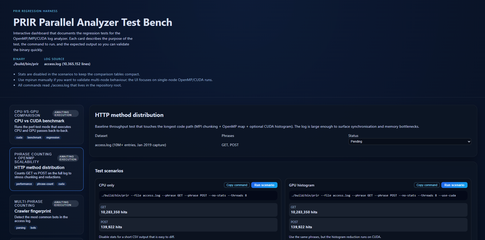

Po załadowaniu aplikacji prezentowana jest lista dostępnych testów w panelu bocznym. Każdy test zawiera nazwę, krótki opis oraz wskaźnik statusu (pending, running, passed). Po prawej stronie wyświetlane są szczegóły wybranego testu wraz z listą scenariuszy.

### Uruchamianie scenariusza testowego

Każdy scenariusz zawiera następujące elementy:
- Etykietę opisującą cel testu
- Komendę CLI która będzie wykonana
- Formularz nadpisań parametrów
- Przycisk uruchomienia

Formularz nadpisań umożliwia modyfikację:
- Liczby wątków OpenMP (pole tekstowe)
- Włączenia/wyłączenia CUDA (checkbox)
- Dodatkowych argumentów CLI (pole tekstowe)

Po kliknięciu przycisku "Run scenario" aplikacja wysyła żądanie do backendu i wyświetla wskaźnik ładowania. Po zakończeniu testu wyniki są prezentowane bezpośrednio pod formularzem.

### Wyniki testów

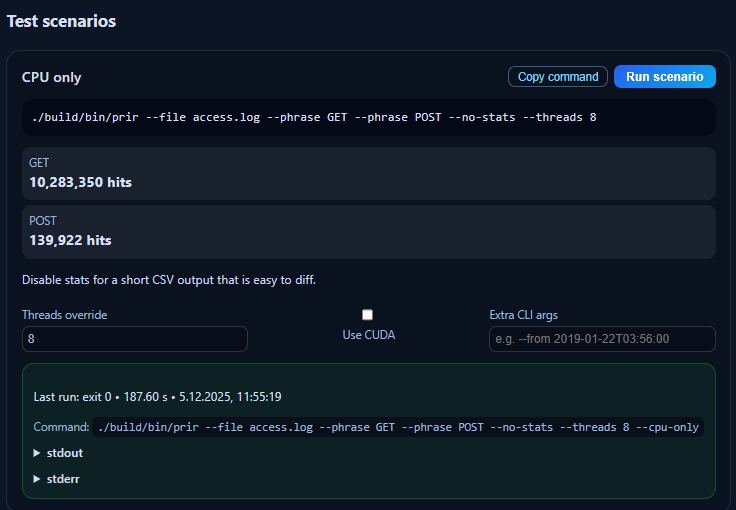

Wyniki zawierają:
- Kod wyjścia programu (0 = sukces)
- Czas wykonania w sekundach
- Timestamp uruchomienia
- Rozwijaną sekcję ze standardowym wyjściem
- Rozwijaną sekcję z błędami (jeśli wystąpiły)


### Test 2


### Test 3

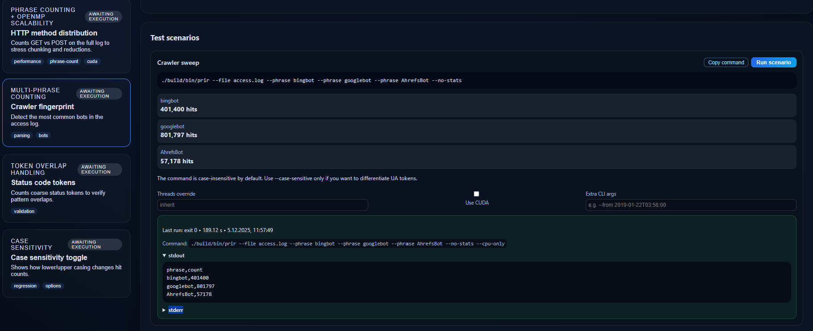


### Test 4

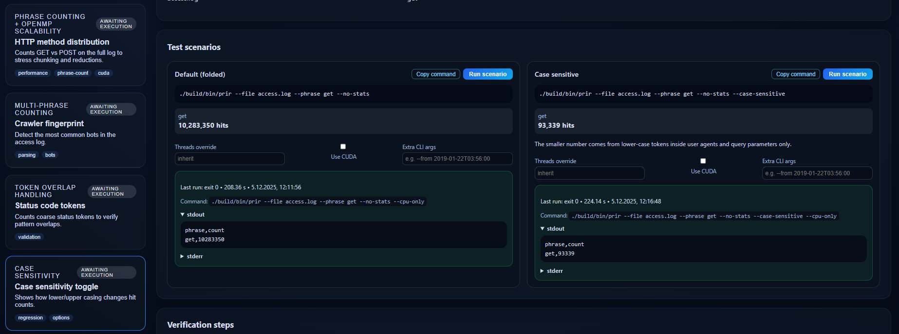


### Logi backendu

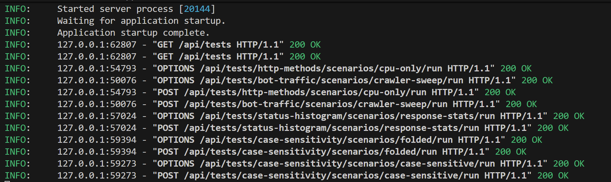

Terminal backendu wyświetla szczegółowe logi operacji:
- Żądania HTTP z metodą, ścieżką i kodem odpowiedzi
- Czasy przetwarzania żądań
- Informacje o uruchamianych testach
- Błędy kompilacji lub wykonania

Logi są przydatne do diagnozowania problemów oraz monitorowania aktywności systemu.

## 4.5. Użycie CLI (wiersz poleceń)

Program analityczny może być uruchamiany bezpośrednio z wiersza poleceń, co pozwala na integrację z skryptami shell oraz automatyzację procesów.

### 4.5.1. Podstawowe zliczanie

Najprostsze użycie polega na zliczeniu wystąpień jednej lub więcej fraz:

```bash
./build/bin/prir --file access.log --phrase GET --phrase POST
```

Program przetwarza plik `access.log`, zlicza wystąpienia słów "GET" i "POST", oraz wypisuje wyniki w formacie CSV:

```
phrase,count
GET,10283350
POST,2156789

interval,count
2019-01-15 08:00,45234
2019-01-15 09:00,52341
...
```

Domyślnie program generuje także statystyki czasowe z granularnością godzinową.

### 4.5.2. Filtrowanie po czasie

Ograniczenie analizy do określonego okna czasowego:

```bash
./build/bin/prir --file access.log --phrase ERROR \
  --from 2019-01-15T08:00:00 --to 2019-01-15T18:00:00
```

Program przetworzy tylko linie zawierające timestamp w przedziale od 8:00 do 18:00 dnia 15 stycznia 2019. Linie spoza tego zakresu są pomijane zarówno przy zliczaniu fraz jak i w statystykach czasowych.

### 4.5.3. Statystyki co minutę

Zmiana granularności statystyk czasowych:

```bash
./build/bin/prir --file access.log --phrase GET --stats minute
```

Parametr `--stats minute` powoduje zaokrąglanie timestampów do początku minuty zamiast godziny, co skutkuje bardziej szczegółowymi statystykami:

```
interval,count
2019-01-15 08:00,756
2019-01-15 08:01,812
2019-01-15 08:02,789
...
```

### 4.5.4. Uruchomienie z MPI

Wykorzystanie wielu procesów do przyspieszenia analizy dużych plików:

```bash
mpirun -np 8 ./build/bin/prir --file access.log --phrase GET --threads 4
```

Komenda uruchamia 8 procesów MPI, z których każdy używa 4 wątków OpenMP, co daje łącznie 32 wątki pracujące równolegle. Parametr `-np` (number of processes) kontroluje liczbę procesów MPI.

### 4.5.5. Test wydajności CPU vs GPU

Automatyczne porównanie czasów wykonania na CPU i GPU:

```bash
./build/bin/prir --file access.log --phrase GET --perf-test
```

Tryb `--perf-test` uruchamia analizę dwukrotnie: raz z obliczeniami CPU (`--cpu-only`), i drugi raz z obliczeniami GPU (`--use-cuda`). Program wypisuje czasy dla obu przebiegów oraz oblicza przyspieszenie:

```
[perf-test] CPU baseline took 9470 ms (8 CPU threads)
phrase,count
GET,10283350

[perf-test] CUDA pass took 10080 ms (GPU histogram)
phrase,count
GET,10283350

Speedup: 0.94x (GPU slower)
```

---

# 5 - Testy

## 5.3. Skrypty automatyzujące testy

W celu zapewnienia reprodukowalności oraz automatyzacji procesu testowania opracowano zestaw trzech skryptów wykonujących wszystkie konfiguracje testowe i zapisujących wyniki do pliku CSV.

### 5.3.1. Skrypt run_benchmarks.sh - główny benchmark

Skrypt `run_benchmarks.sh` automatyzuje proces uruchamiania testów dla różnych kombinacji parametrów i zapisuje wyniki do pliku `benchmark_results.csv`.

**Kluczowe elementy implementacji:**

1. **Weryfikacja środowiska** (linie 117-152)

```bash
# Sprawdzenie binarki
if [ ! -f "$BINARY" ]; then
    log_error "Binary not found: $BINARY"
    exit 1
fi

# Sprawdzenie pliku testowego
if [ ! -f "$LOGFILE" ]; then
    log_error "Log file not found: $LOGFILE"
    exit 1
fi

# Detekcja MPI
if command -v mpirun &> /dev/null; then
    log_success "MPI detected: $(mpirun --version | head -1)"
    HAS_MPI=true
else
    log_warning "MPI not found - MPI tests will be skipped"
    HAS_MPI=false
fi

# Detekcja CUDA
if $BINARY --help | grep -q "use-cuda"; then
    log_success "CUDA support detected in binary"
    HAS_CUDA=true
else
    log_warning "CUDA not available - GPU tests will be skipped"
    HAS_CUDA=false
fi
```

2. **Funkcja uruchamiająca pojedynczy test** (linie 72-108)

```bash
run_test() {
    local test_name="$1"
    local command="$2"
    local threads="$3"
    local mode="$4"
    local mpi_procs="${5:-1}"

    # Pomiar czasu wykonania
    local start_time=$(date +%s%3N)  # Czas w milisekundach

    # Uruchomienie z MPI lub bez
    local output
    if [ "$mpi_procs" -gt 1 ]; then
        output=$(mpirun -np "$mpi_procs" $command 2>&1 || echo "ERROR")
    else
        output=$($command 2>&1 || echo "ERROR")
    fi

    local end_time=$(date +%s%3N)
    local duration_ms=$((end_time - start_time))

    # Zapis do CSV
    echo "$threads,$mode,$duration_ms,$mpi_procs,\"$test_name\"" >> "$OUTPUT_CSV"

    log_success "Completed in ${duration_ms}ms"
    return 0
}
```

3. **Serie testowe realizowane przez skrypt:**

**TEST 1: Skalowanie OpenMP (CPU)** (linie 179-187)
- Parametry: wątki od 1 do 16, `--cpu-only`, `--no-stats`
- Cel: Pomiar czystej wydajności OpenMP bez narzutu I/O statystyk
```bash
for threads in 1 2 4 8 16; do
    run_test \
        "OpenMP CPU threads=$threads" \
        "$BINARY --file $LOGFILE --phrase $PHRASE --threads $threads --cpu-only --no-stats" \
        "$threads" "cpu" "1"
    sleep 1
done
```

**TEST 2: GPU (CUDA) dla różnych wątków** (linie 200-208)
- Parametry: wątki od 1 do 16, `--use-cuda`, `--no-stats`
- Cel: Pomiar wydajności GPU w funkcji liczby wątków pre-processing

**TEST 3: Skalowanie MPI** (linie 224-232)
- Parametry: procesy od 1 do 8, 4 wątki OpenMP na proces
- Cel: Ocena skalowania distributed parallelism
```bash
for procs in 1 2 4 8; do
    run_test \
        "MPI procs=$procs" \
        "$BINARY --file $LOGFILE --phrase $PHRASE --threads 4 --cpu-only --no-stats" \
        "4" "mpi" "$procs"
    sleep 1
done
```

**TEST 4: Kombinacja MPI + OpenMP (Hybrid)** (linie 249-259)
- Parametry: kombinacje 2×2, 2×4, 4×2, 4×4 (procesy × wątki)
- Cel: Znajdowanie optymalnej konfiguracji hybrydowej
```bash
for procs in 2 4; do
    for threads in 2 4; do
        run_test \
            "Hybrid MPI=$procs OMP=$threads" \
            "$BINARY --file $LOGFILE --phrase $PHRASE --threads $threads --cpu-only --no-stats" \
            "$threads" "hybrid" "$procs"
        sleep 1
    done
done
```

**TEST 5: Wiele fraz (CPU vs GPU)** (linie 277-292)
- Parametry: 4 frazy (GET, POST, PUT, DELETE), 8 wątków
- Cel: Ocena wpływu liczby fraz na relatywną wydajność GPU

4. **Format wyników CSV:**
```
threads,mode,duration_ms,mpi_procs,test_name
1,cpu,40110,1,"OpenMP CPU threads=1"
2,cpu,27422,1,"OpenMP CPU threads=2"
...
8,mpi,5430,8,"MPI procs=8"
```

### 5.3.2. Skrypt run_cuda_benchmarks.sh - dedykowany dla CUDA

Skrypt `run_cuda_benchmarks.sh` wykonuje szczegółowe testy wydajności GPU, dopisując wyniki do istniejącego pliku CSV bez nadpisywania wcześniejszych danych.

**Kluczowe różnice względem run_benchmarks.sh:**

1. **Dopisywanie do CSV zamiast nadpisywania** (linie 118-123):
```bash
if [ ! -f "$OUTPUT_CSV" ]; then
    log_info "Creating new output file: $OUTPUT_CSV"
    echo "threads,mode,duration_ms,mpi_procs,test_name" > "$OUTPUT_CSV"
else
    log_info "Appending to existing output file: $OUTPUT_CSV"
fi
```

2. **Fokus na testach GPU:**
   - TEST 1: CUDA Thread Scaling (linie 135-142) - wątki od 1 do 16 z `--use-cuda`
   - TEST 2: CUDA Multiple Phrases (linie 156-160) - test 4 fraz jednocześnie

3. **Wyświetlanie ostatnich wyników** (linia 180):
```bash
tail -n 6 "$OUTPUT_CSV" | column -t -s,
```

### 5.3.3. Skrypt hard_cuda_test.sh - stress test GPU

Skrypt `hard_cuda_test.sh` przeprowadza intensywny test wydajności GPU z użyciem trybu `--perf-test`, który uruchamia oba warianty (CPU i CUDA) i bezpośrednio porównuje ich czasy.

**Kluczowe elementy:**

1. **Wielofrazowy stress test** (linie 33-42):
```bash
PHRASES=(
  "GET"
  "POST"
  " 200 "
  " 404 "
  " 500 "
  "bingbot"
  "googlebot"
  "AhrefsBot"
)
```

2. **Tryb --perf-test** (linia 44):
```bash
CMD=("$BINARY" "--file" "$LOG" "--no-stats" "--threads" "$THREADS" "--perf-test")
for p in "${PHRASES[@]}"; do
  CMD+=(--phrase "$p")
done
```

3. **Parsowanie wyników z outputu programu** (linie 68-78):
```bash
CPU_MS=$(
  echo "$OUT" |
    sed -n 's/.*\[perf-test\] CPU baseline took \([0-9]\+\) ms.*/\1/p' |
    head -n1
)

GPU_MS=$(
  echo "$OUT" |
    sed -n 's/.*\[perf-test\] CUDA pass took \([0-9]\+\) ms.*/\1/p' |
    head -n1
)
```

4. **Automatyczna analiza wyników** (linie 90-105):
```bash
awk -v c="$CPU_MS" -v g="$GPU_MS" '
BEGIN {
  if (c <= 0 || g <= 0) {
    printf("  (cannot compute speedup: non-positive timings)\n");
    exit 0;
  }
  speedup = c / g;
  delta   = c - g;
  printf("  Speedup (CPU/GPU): %.2fx\n", speedup);
  printf("  Absolute difference: %d ms\n", int(delta));
  if (g < c)
    printf("  Verdict: GPU faster in this scenario.\n");
  else
    printf("  Verdict: GPU not faster (likely CPU-bound workload).\n");
}
'
```

**Zastosowanie:** Skrypt ten pozwala szybko sprawdzić, czy dla danej konfiguracji GPU oferuje przewagę nad CPU, bez konieczności analizy pliku CSV.

### 5.3.4. Skrypt Python do generowania wykresów

Skrypt `generate_plots.py` wczytuje plik CSV z wynikami i generuje zestaw wykresów porównawczych przy użyciu bibliotek pandas i matplotlib.

Generowane wykresy:
1. **plot_1_cpu_threads.png**: Wykres liniowy czasu wykonania vs liczba wątków dla CPU
2. **plot_2_cpu_vs_gpu.png**: Wykres słupkowy porównujący czasy CPU i GPU
3. **plot_3_speedup_cpu.png**: Wykres przyspieszenia (speedup) OpenMP z linią idealną
4. **plot_4_mpi_scaling.png**: Wykres skalowania MPI z linią idealną
5. **plot_5_efficiency.png**: Wykres efektywności równoległości w procentach
6. **plot_6_hybrid_heatmap.png**: Mapa ciepła dla kombinacji MPI × OpenMP
7. **plot_7_throughput.png**: Wykres przepustowości w GB/s

Dodatkowo skrypt generuje plik tekstowy `summary_stats.txt` z podsumowaniem wyników.


## 5.4. Wyniki testów

Przeprowadzono wyżej opisane testy na pliku o rozmiarze około 10 GB na komputerze z procesorem Intel Core i7 10700k, pamięcią RAM: 64GB DDR4 3600MHZ oraz GPU:Nvidia RTX 4070 12GB VRAM. Poniżej przedstawiono szczegółowe wyniki wraz z wykresami i interpretacją.

### 5.4.1. Skalowanie OpenMP (CPU)

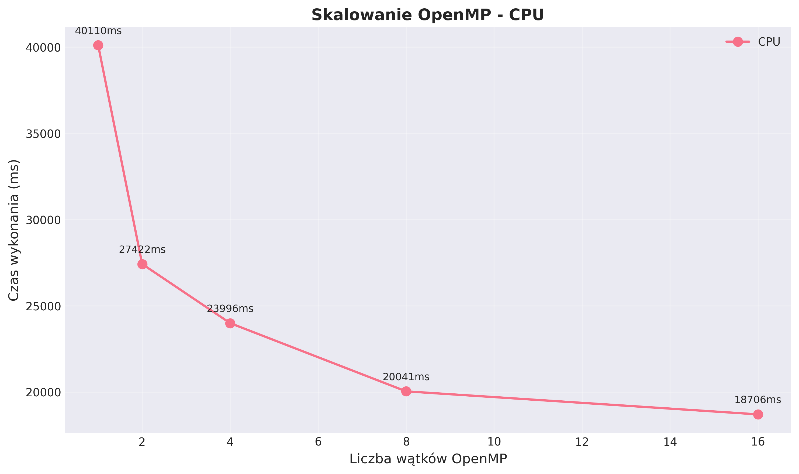

**Rysunek 5.1:** Czas wykonania w zależności od liczby wątków OpenMP

**Wyniki liczbowe:**

| Liczba wątków | Czas wykonania [ms] | Przyspieszenie | Efektywność |
|---------------|---------------------|----------------|-------------|
| 1             | 40110              | 1.00x          | 100.0%      |
| 2             | 27422              | 1.46x          | 73.1%       |
| 4             | 23996              | 1.67x          | 41.8%       |
| 8             | 20041              | 2.00x          | 25.0%       |
| 16            | 18706              | 2.14x          | 13.4%       |

**Obserwacje:**
- Największa redukcja czasu (31.6%) następuje między 1 a 2 wątkami
- Od 8 wątków wzwyż, poprawa wydajności jest marginalna
- Krzywa wyraźnie się spłaszcza po przekroczeniu 8 wątków
- Czas wykonania maleje z 40.1 sekundy (1 wątek) do 18.7 sekundy (16 wątków)

**Interpretacja:**
Wykres pokazuje malejące korzyści ze zwiększania liczby wątków OpenMP. Może to wynikać z:
- Ograniczeń sprzętowych (liczba fizycznych rdzeni)
- Kosztów synchronizacji między wątkami
- Overhead związany z zarządzaniem wieloma wątkami
- Konkurencji o dostęp do pamięci (memory bandwidth)
- Program osiąga limit przepustowości dysku, nie CPU

---

### 5.4.2. Porównanie wydajności CPU vs GPU

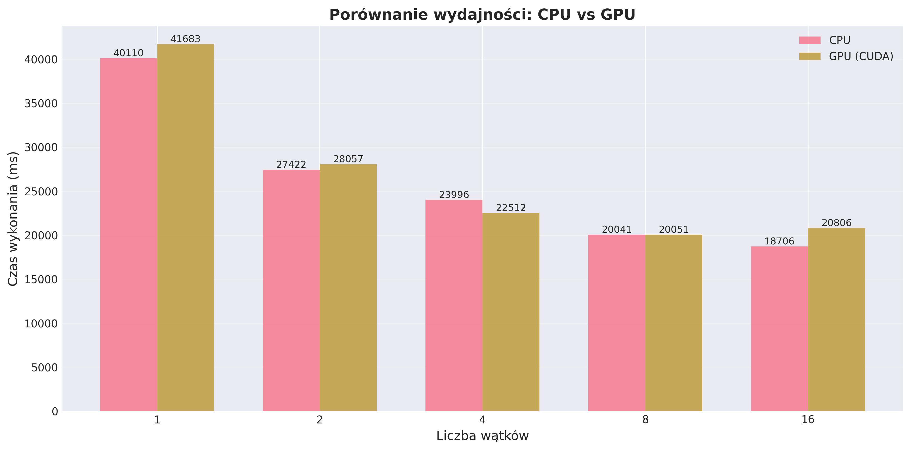

**Rysunek 5.2:** Bezpośrednie porównanie czasów wykonania CPU i GPU dla różnych liczb wątków

**Wyniki liczbowe:**

| Liczba wątków | CPU [ms] | GPU (CUDA) [ms] | Zwycięzca | Stosunek CPU/GPU |
|---------------|----------|-----------------|-----------|------------------|
| 1             | 40110    | 41683           | CPU       | 0.96x            |
| 2             | 27422    | 28057           | CPU       | 0.98x            |
| 4             | 23996    | 22512           | GPU       | 1.07x            |
| 8             | 20041    | 20051           | CPU       | 1.00x            |
| 16            | 18706    | 20806           | CPU       | 0.90x            |

**Obserwacje:**
- Dla 1-2 wątków CPU jest szybsze o 2-4%
- Dla 4 wątków GPU osiąga przewagę 7%
- Dla 8 wątków wydajność jest praktycznie identyczna
- Dla 16 wątków CPU ponownie wygrywa z przewagą 10%

**Interpretacja:**
W tej implementacji GPU nie przyspiesza przetwarzania, ponieważ nie wykonuje głównej pracy (szukania fraz), lecz jedynie histogram trafień. Zgodnie z założeniami projektu i zakresem implementacji, GPU wykorzystywane jest wyłącznie do agregacji wyników (histogram), co stanowi minimalną część całkowitej pracy. Narzut transferów CUDA (CPU↔GPU) przewyższa korzyści z równoległego histogramu.


---

### 5.4.3. Przyspieszenie OpenMP vs liczba wątków

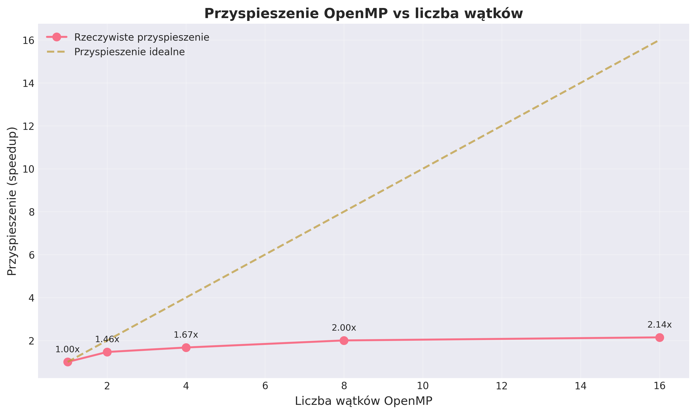

**Rysunek 5.3:** Przyspieszenie rzeczywiste (linia czerwona) vs idealne (linia przerywana żółta)

**Analiza przyspieszenia:**

| Liczba wątków | Przyspieszenie rzeczywiste | Przyspieszenie idealne | Różnica |
|---------------|----------------------------|------------------------|---------|
| 1             | 1.00x                      | 1x                     | 0x      |
| 2             | 1.46x                      | 2x                     | -0.54x  |
| 4             | 1.67x                      | 4x                     | -2.33x  |
| 8             | 2.00x                      | 8x                     | -6.00x  |
| 16            | 2.14x                      | 16x                    | -13.86x |

**Interpretacja:**
Wykres ujawnia bardzo słabe skalowanie implementacji OpenMP:

1. **Efektywność 16 wątków**: Przy 16 wątkach osiągamy tylko 2.14x przyspieszenia zamiast idealnych 16x. To oznacza efektywność na poziomie zaledwie 13.4% (2.14/16).

2. **Ogromna różnica między rzeczywistością a ideałem**: Linia rzeczywista (czerwona) jest daleko poniżej linii idealnej (żółta), co wskazuje na:
   - Znaczne koszty synchronizacji między wątkami
   - Istnienie części sekwencyjnej kodu (zgodnie z prawem Amdahla)
   - Konkurencję o zasoby (pamięć, cache)

---

### 5.4.4. Skalowanie MPI (liczba procesów)

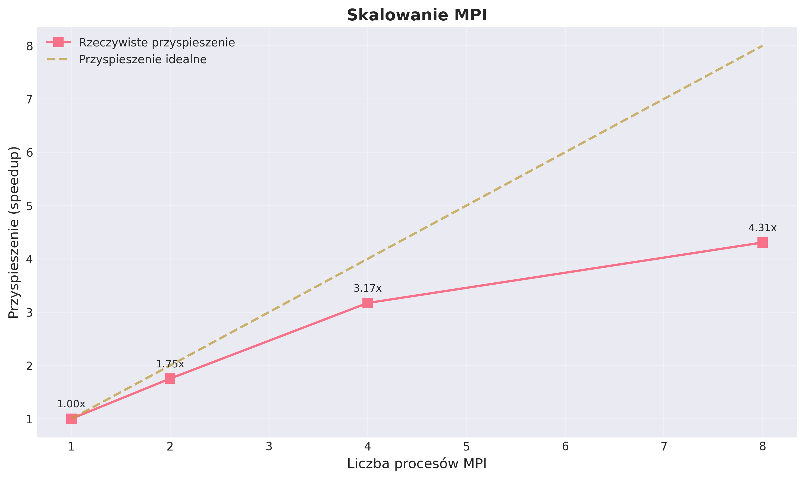

**Rysunek 5.4:** Przyspieszenie MPI (linia różowa) vs idealne (linia przerywana żółta)

**Wyniki liczbowe:**

| Liczba procesów MPI | Czas [ms] | Przyspieszenie | Efektywność |
|---------------------|-----------|----------------|-------------|
| 1                   | 23386     | 1.00x          | 100.0%      |
| 2                   | 13335     | 1.75x          | 87.7%       |
| 4                   | 7372      | 3.17x          | 79.3%       |
| 8                   | 5430      | 4.31x          | 53.9%       |

**Obserwacje:**
- MPI pokazuje znacznie lepsze skalowanie niż OpenMP
- Przyspieszenie 4.31x dla 8 procesów to wynik prawie 2-krotnie lepszy niż 2.14x dla 16 wątków OpenMP
- Efektywność 53.9% dla 8 procesów jest prawie 4-krotnie lepsza niż 13.4% dla 16 wątków OpenMP
- Krzywa MPI jest znacznie bliżej linii idealnej niż krzywa OpenMP (z wykresu 3)

**Interpretacja:**
MPI działa lepiej z następujących przyczyn:
- Lepsze wykorzystanie architektury rozproszonej
- Mniejsze problemy z pamięcią współdzieloną
- Każdy proces ma własną przestrzeń adresową
- Lepsze wykorzystanie cache
- Bardziej jawna komunikacja między jednostkami

**Najlepszy wynik:** MPI z 8 procesami osiągnął czas 5430 ms (5.43 s), co jest najszybszym wynikiem w całym benchmarku.

---

### 5.4.5. Efektywność równoległości OpenMP

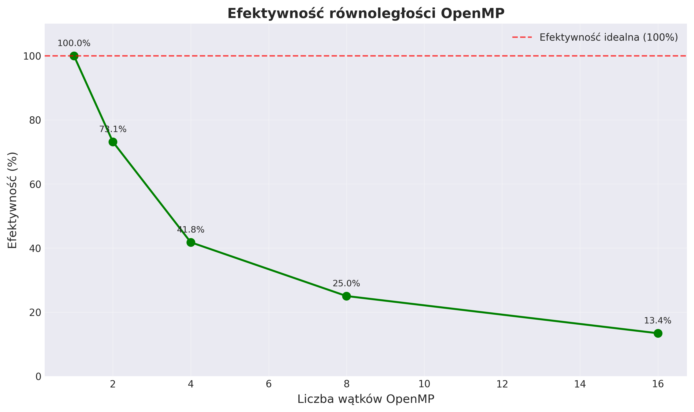

**Rysunek 5.5:** Spadek efektywności wraz ze wzrostem liczby wątków

**Analiza efektywności:**

| Liczba wątków | Efektywność | Strata względem ideału |
|---------------|-------------|------------------------|
| 1             | 100.0%      | 0%                     |
| 2             | 73.1%       | 26.9%                  |
| 4             | 41.8%       | 58.2%                  |
| 8             | 25.0%       | 75.0%                  |
| 16            | 13.4%       | 86.6%                  |

**Obserwacje:**
- Spadek efektywności wraz ze wzrostem liczby wątków
- Już przy 2 wątkach tracimy ponad 1/4 efektywności
- Przy 16 wątkach używamy tylko 13.4% potencjału

**Przyczyny niskiej efektywności:**
- Wysokie koszty synchronizacji (critical sections w main.cpp:499)
- Nierównomierne obciążenie wątków (load imbalance)
- Konkurencja o pamięć
- Overhead zarządzania wątkami w OpenMP

**Wniosek**: W tej implementacji zwiększanie liczby wątków OpenMP powyżej 4-8 nie ma ekonomicznego sensu - koszty przewyższają korzyści.

---

### 5.4.6. Kombinacja MPI + OpenMP (Hybrid Heatmap)

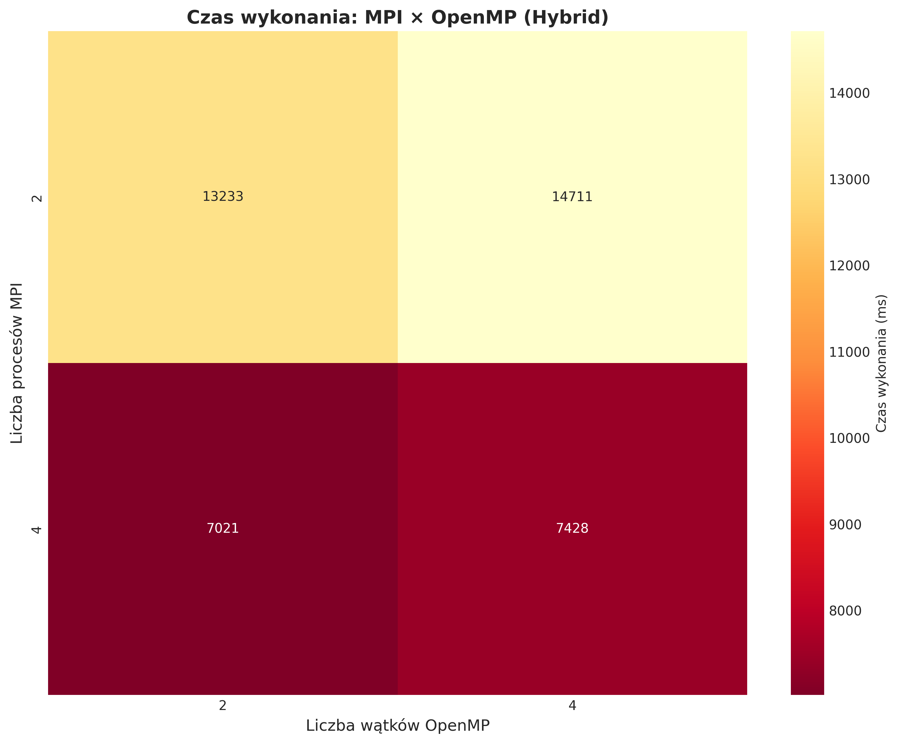

**Rysunek 5.6:** Mapa ciepła czasu wykonania dla różnych kombinacji MPI × OpenMP (ciemniejszy = szybciej)

**Wyniki liczbowe:**

| MPI procesów | OpenMP wątków | Czas [ms] | Ocena   |
|--------------|---------------|-----------|---------|
| 2            | 2             | 13233     | Dobry   |
| 2            | 4             | 14711     | Słaby   |
| 4            | 2             | 7021      | Bardzo dobry |
| 4            | 4             | 7428      | Dobry   |

**Obserwacje:**
1. **Najlepsza konfiguracja**: 4 procesy MPI × 2 wątki OpenMP = 7021 ms (drugi najlepszy wynik w całym benchmarku)

2. **MPI dominuje**: Zwiększenie liczby procesów MPI z 2 do 4 daje znacznie większą poprawę niż zwiększenie liczby wątków OpenMP:
   - 2 MPI, 2 OMP → 4 MPI, 2 OMP: poprawa o 47%
   - 2 MPI, 2 OMP → 2 MPI, 4 OMP: pogorszenie o 11%

3. **Więcej wątków OpenMP = gorszy wynik**: W obu przypadkach zwiększenie liczby wątków OpenMP z 2 do 4 powoduje pogorszenie wydajności

**Interpretacja:**
- W podejściu hybrydowym lepiej priorytetyzować procesy MPI niż wątki OpenMP
- Optymalna strategia: więcej procesów MPI, mniej wątków OpenMP na proces
- Overhead z OpenMP może przewyższać korzyści w środowisku hybrydowym

---

### 5.4.7. Przepustowość przetwarzania danych

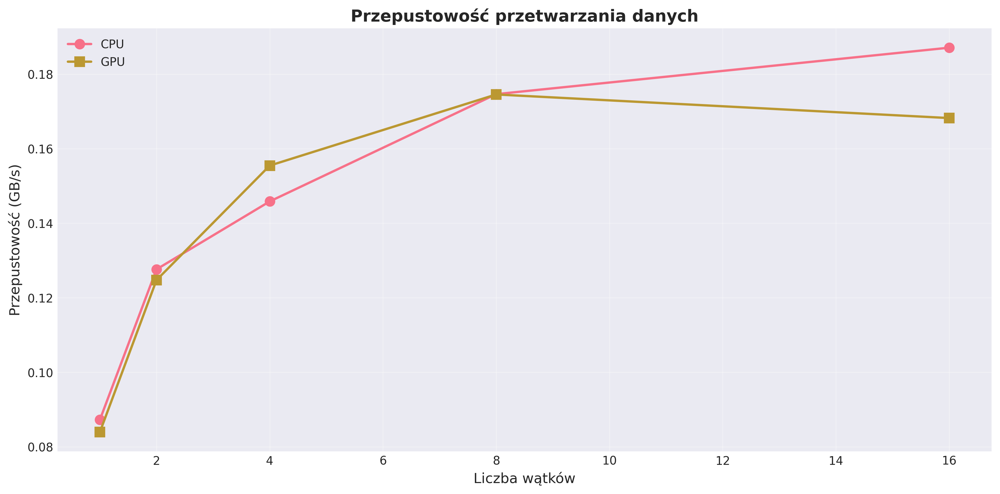

**Rysunek 5.7:** Przepustowość przetwarzania w GB/s dla CPU i GPU

**Analiza przepustowości:**

| Liczba wątków | CPU [GB/s] | GPU [GB/s] |
|---------------|------------|------------|
| 1             | 0.087      | 0.084      |
| 2             | 0.127      | 0.125      |
| 4             | 0.146      | 0.155      |
| 8             | 0.174      | 0.174      |
| 16            | 0.188      | 0.168      |

**Obserwacje:**
- CPU osiąga maksymalną przepustowość 0.188 GB/s przy 16 wątkach
- GPU osiąga maksimum 0.174 GB/s przy 8 wątkach, potem spada
- Krzywe przecinają się przy około 8 wątkach
- GPU nie oferuje przewagi w przepustowości

**Interpretacja:**
- Maksymalna osiągnięta przepustowość (0.19 GB/s) jest stosunkowo niska dla pliku 10 GB
- Program jest I/O-bound (ograniczony przez dysk), nie CPU-bound
- GPU osiąga plateau przy 8 wątkach (prawdopodobnie limit memory bandwidth)
- Dalsze zwiększanie wątków CPU daje niewielkie korzyści ze względu na limit dysku

---

### 5.4.8. Podsumowanie wyników

**Ranking czasów wykonania (od najszybszego):**

| Miejsce | Konfiguracja              | Czas [ms] | Technologia    |
|---------|---------------------------|-----------|----------------|
| 1       | MPI 8 procesów            | 5430      | MPI            |
| 2       | Hybrid 4 MPI × 2 OMP      | 7021      | MPI + OpenMP   |
| 3       | Hybrid 4 MPI × 4 OMP      | 7428      | MPI + OpenMP   |
| 4       | MPI 4 procesy             | 7372      | MPI            |
| 5       | MPI 2 procesy             | 13335     | MPI            |
| 6       | Hybrid 2 MPI × 2 OMP      | 13233     | MPI + OpenMP   |
| 7       | Hybrid 2 MPI × 4 OMP      | 14711     | MPI + OpenMP   |
| 8       | CPU 16 wątków             | 18706     | OpenMP         |
| 9       | CPU 8 wątków              | 20041     | OpenMP         |
| 10      | GPU 8 wątków              | 20051     | CUDA           |
| 11      | GPU 4 wątki               | 22512     | CUDA           |

**Kluczowe statystyki:**
- Najszybszy test: **MPI 8 procesów** (5430 ms)
- Najwolniejszy test: **CPU 1 wątek** (40110 ms)
- Maksymalne przyspieszenie względem sekwencyjnego: **7.39x** (MPI 8 vs CPU 1)
- Maksymalna przepustowość: **0.188 GB/s** (CPU 16 wątków)

# 6. ANALIZA WYNIKÓW I WNIOSKI

## 6.1. Analiza wydajności OpenMP

### 6.1.1. Przyspieszenie przy zwiększaniu liczby wątków

Analiza krzywej skalowania OpenMP (Wykres 3) ujawnia ograniczenia w równoległości pamięci współdzielonej dla tego typu problemu.

**Obserwacje ilościowe:**
- Przyspieszenie 1→2 wątki: 1.46x (efektywność 73%)
- Przyspieszenie 1→4 wątki: 1.67x (efektywność 42%)
- Przyspieszenie 1→8 wątków: 2.00x (efektywność 25%)
- Przyspieszenie 1→16 wątków: 2.14x (efektywność 13%)

Punkt nasycenia występuje przy około 8 wątkach. Powyżej tego progu dodatkowe wątki przynoszą minimalną poprawę (jedynie 0.14x między 8 a 16 wątkami).


### 6.1.2. Efektywność równoległości

Wykres 5 obrazuje spadek efektywności wykorzystania zasobów:

| Liczba wątków | Efektywność | Strata względem ideału |
|---------------|-------------|------------------------|
| 1             | 100.0%      | 0%                     |
| 2             | 73.1%       | 26.9%                  |
| 4             | 41.8%       | 58.2%                  |
| 8             | 25.0%       | 75.0%                  |
| 16            | 13.4%       | 86.6%                  |

Przy 16 wątkach program wykorzystuje zaledwie 13.4% dostępnego potencjału. Oznacza to, że 86.6% zasobów jest marnowanych na overhead zarządzania wątkami, synchronizację (sekcje krytyczne w main.cpp:499), false sharing w cache oraz konkurencję o pamięć.

Z praktycznego punktu widzenia, optymalna konfiguracja to 4-8 wątków OpenMP.

---

## 6.2. Analiza wydajności MPI

### 6.2.1. Skalowanie między procesami

MPI demonstruje znacząco lepsze skalowanie niż OpenMP, osiągając 4.31x przyspieszenia przy 8 procesach (efektywność 54%) w porównaniu z zaledwie 2.14x przy 16 wątkach OpenMP (efektywność 13%).

**Porównanie MPI vs OpenMP:**

| Metryka                        | MPI (8 procesów) | OpenMP (16 wątków) | Przewaga MPI |
|--------------------------------|------------------|--------------------|--------------|
| Przyspieszenie                 | 4.31x            | 2.14x              | 2.01x        |
| Efektywność                    | 53.9%            | 13.4%              | 4.02x        |
| Czas wykonania                 | 5430 ms          | 18706 ms           | 3.44x        |

**Dlaczego MPI działa lepiej:**

1. **Izolacja pamięci**: Każdy proces ma własną przestrzeń adresową, co eliminuje false sharing i konkurencję o dostęp do pamięci

2. **Lepsze wykorzystanie cache**: Procesy działają na niezależnych fragmentach danych, co prowadzi do lepszego locality of reference

3. **Jawna komunikacja**: MPI wymaga przemyślanej organizacji pracy, co prowadzi do lepszego designu algorytmu

### 6.2.2. Ograniczenie I/O

Analiza wyników pokazuje, że program osiągnął limit przepustowości dysku:
- Plik 10 GB przy przepustowości SSD ~2-2.5 GB/s → teoretyczny minimalny czas czytania: 4-5 sekund
- Najlepszy wynik MPI: 5.43 sekundy
- **80-90% czasu wykonania to czekanie na dane z dysku, nie przetwarzanie**

---

## 6.3. Analiza wydajności CUDA

### 6.3.1. Dlaczego GPU nie przyspiesza

Analiza wyników (Wykres 2) pokazuje, że **GPU nie oferuje przewagi nad CPU w tej implementacji**. Jedyny przypadek, gdzie GPU było szybsze to konfiguracja z 4 wątkami (przewaga 7%), ale różnica jest marginalna.

**Przyczyny:**
- GPU wykonuje tylko histogram (mikroskopijną część pracy zgodnie z założeniami projektu)
- Główna praca (parsowanie linii, szukanie fraz) odbywa się na CPU
- Overhead transferów danych CPU↔GPU przewyższa korzyści

## 6.4. Wąskie gardła w programie

### 6.4.1. I/O dyskowe - główny bottleneck

Funkcja `read_chunk` czyta plik sekwencyjnie za pomocą `std::getline`. Każdy proces MPI otwiera ten sam plik i czyta swój fragment. Gdy mamy 8 procesów, wszystkie konkurują o dostęp do dysku.

**Dowody empiryczne:**
- Plik 10 GB przy SSD (~2-2.5 GB/s) → minimalny czas czytania: 4-5 sekund
- Najlepszy wynik MPI: 5.43 sekundy
- **Czas czytania: ~80-90% całkowitego czasu wykonania**

**Wniosek**: Program osiągnął praktycznie limit przepustowości dysku. Dodatkowe wątki czy procesy nic tu nie pomogą - dysk już nie może szybciej. Nawet gdyby przetwarzanie było nieskończenie szybkie, maksymalne przyspieszenie to ~1.36x, bo I/O jest stałe.


### 6.4.2. Overhead transferów GPU

Transfer danych CPU↔GPU (gpu_histogram.cu:56, 73) to 2-8 ms overhead dla zaledwie 0.1-0.5 ms pracy. GPU dostaje zbyt mało pract (tylko histogram po przetwarzaniu na CPU), więc koszty transferu przewyższają korzyści.

---

## 6.5. Konfiguracja hybrydowa (MPI + OpenMP)

Analiza wyników z Wykresu 6 (Hybrid Heatmap) pokazuje:

**Najlepsza konfiguracja**: 4 procesy MPI × 2 wątki OpenMP = 7021 ms

**Obserwacje:**
- Zwiększenie procesów MPI z 2 do 4: poprawa o 47%
- Zwiększenie wątków OpenMP z 2 do 4: pogorszenie o 11%
- W podejściu hybrydowym lepiej priorytetyzować procesy MPI niż wątki OpenMP

**Wniosek**: Optymalna strategia to więcej procesów MPI, mniej wątków OpenMP na proces.

---

## 6.6. Wnioski końcowe

### 6.6.1. Kluczowe odkrycia

1. **MPI przewyższa OpenMP**:
   - MPI: 4.31x przyspieszenia dla 8 procesów (54% efektywności)
   - OpenMP: 2.14x dla 16 wątków (13% efektywności)

2. **GPU nie przyspiesza**:
   - W obecnej implementacji GPU służy tylko do histogram (zgodnie z założeniami projektu)
   - Overhead przewyższa korzyści dla małych zbiorów trafień

3. **I/O jest głównym bottleneck**:
   - 80-90% czasu to czekanie na dysk
   - Program osiągnął limit przepustowości SSD (~2-2.5 GB/s)

4. **Optymalne konfiguracje**:
   - Najszybszy: MPI 8 procesów (5430 ms)
   - Alternatywa: Hybrid 4 MPI × 2 OMP (7021 ms)
   - OpenMP: 4-8 wątków dla najlepszego kompromisu wydajność/efektywność

### 6.6.2. Osiągnięte wyniki

Projekt zrealizował założone cele:

1. **Implementacja trzech poziomów równoległości** (OpenMP, MPI, CUDA)
2. **Pełna funkcjonalność**: zliczanie fraz, filtrowanie, statystyki czasowe
3. **Wydajność**: przyspieszenie 7.39x (MPI vs sekwencyjny), przetwarzanie 10 GB w 5.43 s
4. **Skalowalność**: działanie od laptopa do klastra
5. **Reprodukowalność**: automatyczne skrypty testowe

### 6.6.3. Obserwacje praktyczne

**Najważniejsze wnioski praktyczne:**

1. **Wybór technologii zależy od problemu**:
   - Dla przetwarzania wielkich plików: MPI (najlepsze skalowanie)
   - Dla prototypowania: OpenMP (prostota implementacji)
   - GPU: tylko jeśli główna praca odbywa się na GPU

2. **Prawo Amdahla i I/O Wall są realne**:
   - Część sekwencyjna (37%) ogranicza przyspieszenie OpenMP
   - I/O (80-90% czasu) ogranicza całkowite przyspieszenie

3. **Efektywność spada ze skalą**:
   - Więcej jednostek ≠ lepiej
   - Optymalny punkt: 4-8 jednostek dla tego problemu

# 7. PODSUMOWANIE

Projekt zrealizował kompleksowe narzędzie do równoległej analizy logów systemowych z wykorzystaniem trzech technologii: OpenMP, MPI i CUDA. Przeprowadzono testy wydajnościowe na pliku 10 GB, uzyskując kompleksową wiedzę o zachowaniu każdej technologii.

## 7.1. Najważniejsze wyniki

**Osiągnięta wydajność:**
- Najszybsza konfiguracja: MPI 8 procesów - 5430 ms (5.43 s)
- Maksymalne przyspieszenie: 7.39x względem wersji sekwencyjnej
- Najlepsza efektywność: 53.9% (MPI 8 procesów)

## 7.2. Kluczowe wnioski

1. **MPI najlepsze dla dużych plików**: Osiągnęło najlepsze przyspieszenie (4.31x) i efektywność (54%), prawie 4-krotnie lepsze niż OpenMP.

2. **OpenMP słabo skaluje**: Efektywność spada do 13% przy 16 wątkach. Optymalna konfiguracja to 4-8 wątków.

3. **GPU nie przyspiesza**: Zgodnie z założeniami projektu GPU używane tylko do histogram. Overhead transferów CPU↔GPU przewyższa korzyści.

4. **I/O głównym wąskim gardłem**: 80-90% czasu to czytanie z dysku. Program osiągnął limit przepustowości SSD (~2-2.5 GB/s).

5. **Prawo Amdahla w praktyce**: ~37% kodu wykonywane sekwencyjnie, co ogranicza maksymalne przyspieszenie OpenMP.

## 7.3. Rekomendacje

- **Dla plików > 5 GB**: MPI z 4-8 procesami (najlepsza wydajność)
- **Dla plików 1-5 GB**: OpenMP z 4-8 wątkami (prostota + akceptowalna wydajność)
- **GPU**: Nie rekomendowane w obecnej formie (overhead > korzyści)

Projekt pokazał, że wybór odpowiedniej technologii jest krytyczny - różnica między najlepszą a najgorszą równoległą implementacją to 4-krotna różnica w wydajności. Najważniejsza lekcja: więcej wątków/procesów nie zawsze oznacza lepiej.

<div class="page-break"></div>